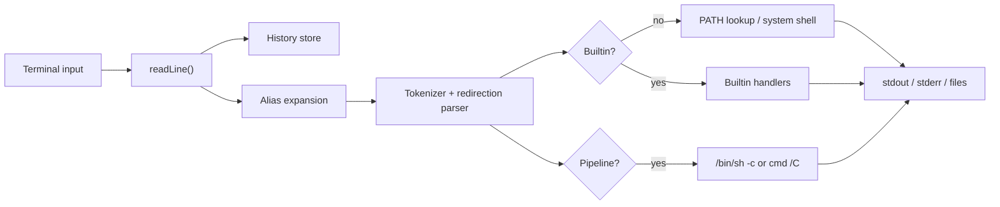
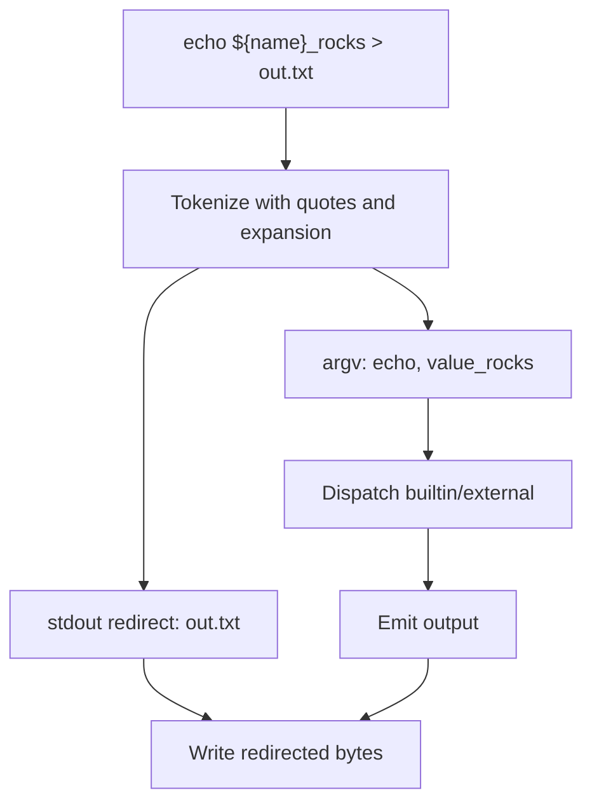
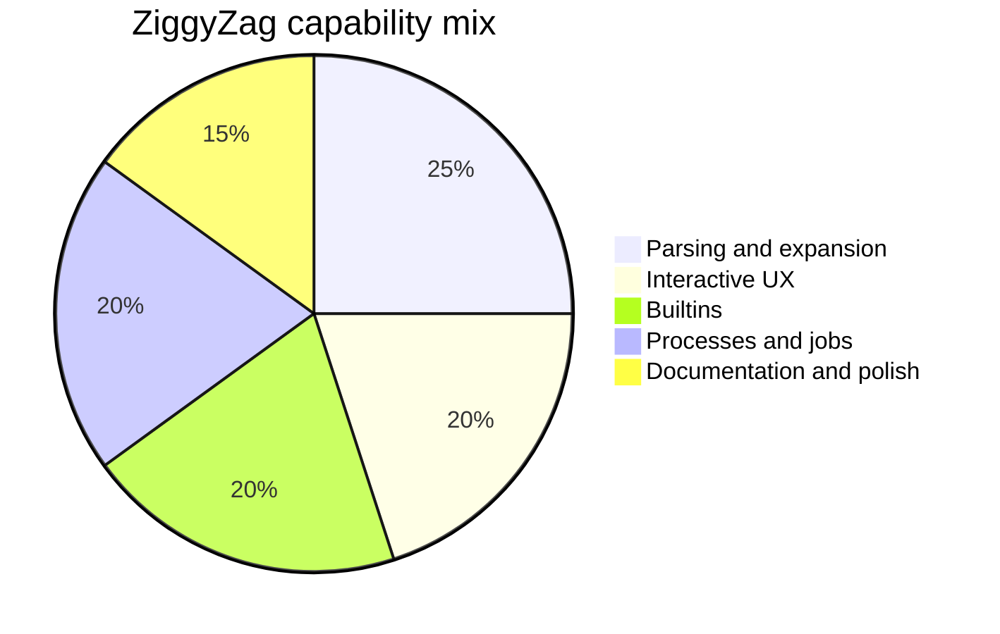

<p align="center">
  
</p>

<h1 align="center">ZiggyZag</h1>

<p align="center">
  A Zig-powered shell playground with real parsing, history, completions, jobs, aliases, and parameter expansion.
</p>

<p align="center">
  <a href="https://github.com/PascalAI2024/ZiggyZag"></a>
  
  
  <a href="https://app.codecrafters.io/courses/shell/overview"></a>
</p>

[](https://app.codecrafters.io/users/codecrafters-bot?r=2qF)

ZiggyZag started as a completed CodeCrafters "Build Your Own Shell" project and is now being shaped into a small, readable, hackable shell for people who want to learn how shells work without getting buried in decades of compatibility code.

It is intentionally compact, but it already covers the fundamentals: a REPL, token parsing, quotes, redirection, pipelines, completion, history persistence, background jobs, shell variables, parameter expansion, and a few quality-of-life commands for real use.

## Why It Exists

Most shells are either mature production tools with a lot of historical surface area or tiny demos that stop after `echo`. ZiggyZag sits in the middle:

- Small enough to read in one focused sitting.
- Complete enough to demonstrate the hard parts of shell behavior.
- Friendly enough to use as a personal shell lab.
- Written in Zig so memory ownership, process spawning, and terminal behavior stay visible.

## Quick Start

```sh
git clone https://github.com/PascalAI2024/ZiggyZag.git
cd ZiggyZag
zig build
./zig-out/bin/ziggyzag
```

On Windows PowerShell:

```powershell
git clone https://github.com/PascalAI2024/ZiggyZag.git
cd ZiggyZag
zig build
.\zig-out\bin\ziggyzag.exe
```

You can also run the CodeCrafters-compatible wrapper:

```sh
./your_program.sh
```

## Try This

```sh
declare project=ZiggyZag
echo hello_${project}

alias gs='git status --short'
gs

export EDITOR=vim
echo $EDITOR

history 5
```

## Feature Map

| Area | Status | Notes |
| --- | --- | --- |
| REPL prompt | Done | Interactive command loop with manual terminal echo support. |
| Builtins | Done | `cd`, `pwd`, `echo`, `type`, `history`, `jobs`, `complete`, `declare`, `help`, `alias`, `unalias`, `export`, `unset`, `exit`. |
| External programs | Done | PATH lookup and process spawning. |
| Quoting | Done | Single quotes, double quotes, and backslash behavior. |
| Redirection | Done | stdout/stderr redirect and append forms. |
| Pipelines | Done | Delegates pipeline execution to the system shell. |
| Completion | Done | Builtin, executable, path, and programmable completion. |
| History | Done | Listing, navigation, command recall, read/write/append, and `HISTFILE` persistence. |
| Job control | Done | Background jobs, `jobs`, reaping, and job number reuse. |
| Parameter expansion | Done | `$VAR`, `${VAR}`, missing variables, and shell variable storage. |
| Developer polish | In progress | Repo docs, diagrams, refactors, and user-facing enhancements. |

## Architecture





## Capability Mix



## Project Layout

```text
.
|-- assets/
|   `-- ziggyzag-logo.svg
|-- docs/
|   |-- ARCHITECTURE.md
|   |-- FEATURES.md
|   `-- ROADMAP.md
|-- src/
|   `-- main.zig
|-- build.zig
|-- build.zig.zon
|-- your_program.sh
`-- codecrafters.yml
```

## Docs

- [Architecture](docs/ARCHITECTURE.md)
- [Features and roadmap](docs/FEATURES.md)
- [Research-backed roadmap](docs/ROADMAP.md)
- [Contributing](CONTRIBUTING.md)

## Development

Build:

```sh
zig build
```

Run:

```sh
zig build run
```

Format:

```sh
zig fmt src/main.zig
```

Smoke test:

```sh
printf "help\nalias hi='echo hello'\nhi world\nexit\n" | ./zig-out/bin/ziggyzag
```

## Roadmap

The next wave is about making ZiggyZag feel delightful while keeping the codebase approachable:

- Autosuggestions from history.
- Rich completions with descriptions and fuzzy filtering.
- Abbreviations that expand visibly before execution.
- Optional config file for aliases and startup commands.
- Context-aware prompt modules with git/status segments.
- Native pipeline implementation instead of system-shell delegation.
- SQLite-backed history and fuzzy Ctrl-R search.
- More tests outside the CodeCrafters harness.

See [docs/ROADMAP.md](docs/ROADMAP.md) for feature ideas inspired by fish, zsh, Nushell, PowerShell, Atuin, Starship, and other modern shell tools.

## Credits

Built by [PascalAI2024](https://github.com/PascalAI2024) while completing the CodeCrafters shell challenge, then extended as an open-source learning project.

## License

MIT. See [LICENSE](LICENSE).
