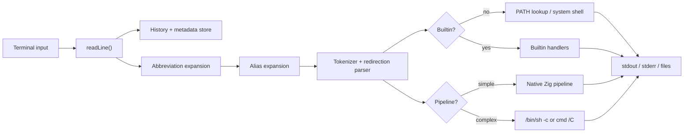
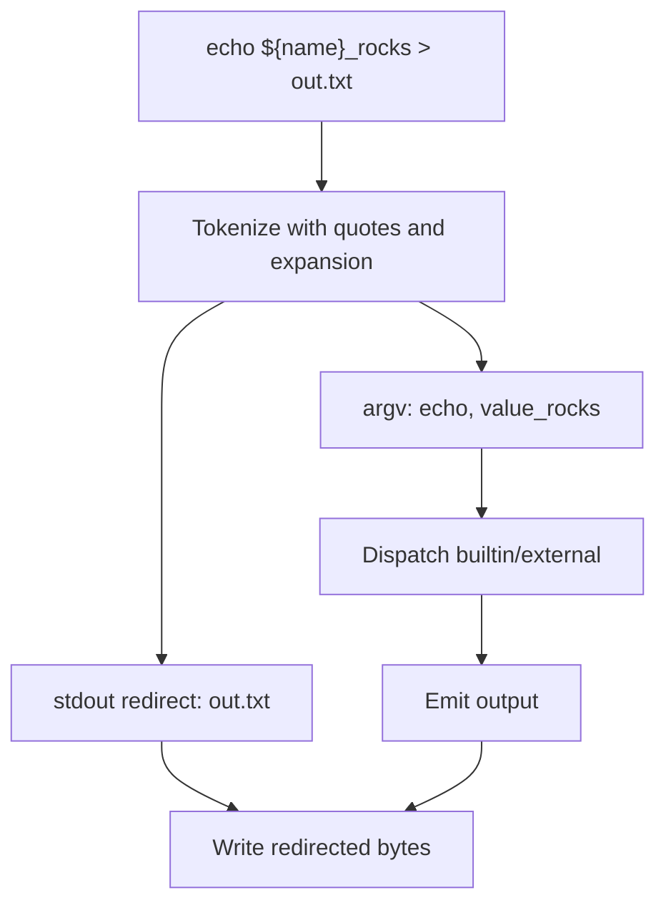
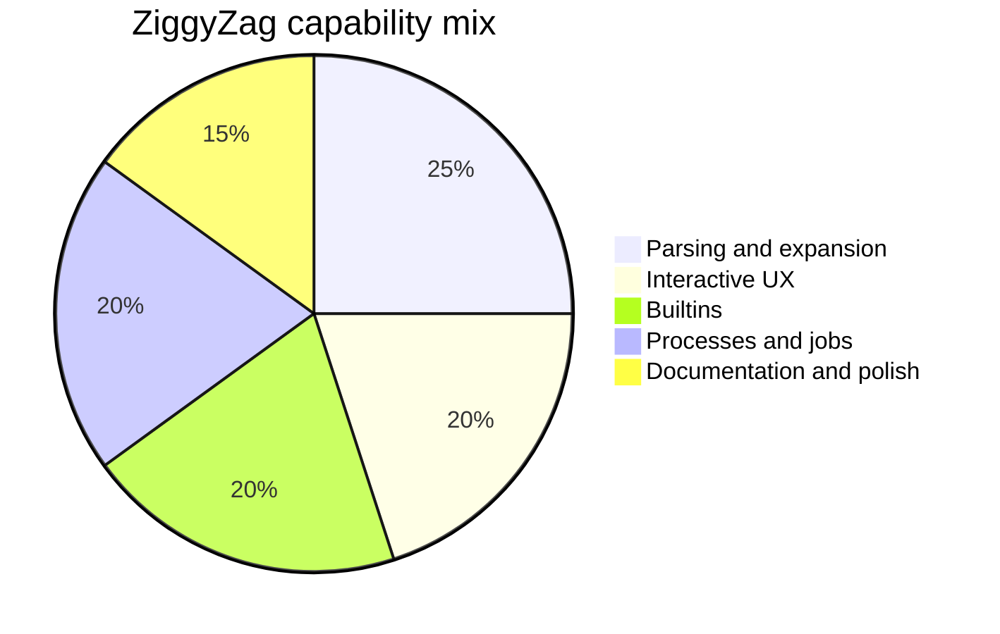

<p align="center">
  
</p>

<h1 align="center">ZiggyZag</h1>

<p align="center">
  A Zig-powered shell workspace with real parsing, history, completions, jobs, aliases, abbreviations, smart prompts, cross-platform shell builds, a Windows-native terminal host, and a slim AI agent sidecar.
</p>

<p align="center">
  <a href="https://github.com/PascalAI2024/ZiggyZag"></a>
  <a href="https://github.com/PascalAI2024/ZiggyZag/actions/workflows/ci.yml"></a>
  
  
  <a href="https://app.codecrafters.io/courses/shell/overview"></a>
</p>

ZiggyZag started as a completed CodeCrafters "Build Your Own Shell" project and is now an open-source, readable, hackable shell for people who want to learn how shells work without getting buried in decades of compatibility code.

The repo is now scoped as a workspace: the Zig shell remains the working core, `ziggyzag-agentd` provides a small JSON-lines agent process for terminal-aware assistance experiments, and the desktop lane is Windows-native first with a terminal-attached POSIX launcher for macOS and Linux alpha builds.

It is intentionally compact, but it already covers the fundamentals: a REPL, token parsing, quotes, redirection, native simple pipelines, completion, history persistence, metadata history, background jobs, shell variables, parameter expansion, project-aware tasks, directory navigation, and a few quality-of-life commands for real use.

Suggested GitHub repo description:

```text
Alpha Zig shell workspace with a readable shell core, Windows-native terminal host, POSIX launcher, and slim AgentD sidecar.
```

## Why It Exists

Most shells are either mature production tools with a lot of historical surface area or tiny demos that stop after `echo`. ZiggyZag sits in the middle:

- Small enough to read in one focused sitting.
- Complete enough to demonstrate the hard parts of shell behavior.
- Friendly enough to use as a personal shell lab.
- Written in Zig so memory ownership, process spawning, and terminal behavior stay visible.

## What Is In The Box

ZiggyZag is split into a few deliberately small pieces:

- [`apps/shell`](apps/shell): the shell itself, including parsing, expansion, builtins, history, jobs, completion, and interactive editing.
- [`apps/desktop`](apps/desktop/README.md): the native terminal host. Windows has the full Win32/ConPTY alpha; macOS/Linux currently use a terminal-attached launcher.
- [`apps/launcher`](apps/launcher): the friendly launcher entry point used by release zips.
- [`apps/agentd`](apps/agentd/README.md): a slim JSON-lines sidecar for terminal-aware assistance experiments.

For installation and command examples, use the dedicated [Quick Start](docs/QUICK_START.md). For the full documentation map, use [docs/README.md](docs/README.md).

## Current Alpha Shape

The alpha is practical but intentionally honest about platform maturity:

- Windows has the first full native desktop host: a Win32 window, ConPTY shell process, terminal grid, copy/paste, wheel scrollback, status bar, command palette, scrollback search, quick select, live theme switching, and config loading.
- macOS/Linux build the shell, AgentD, and a terminal-attached desktop launcher. The native graphical host for those platforms is still future work.
- Split panes and the desktop AgentD side panel are now in the Windows alpha. Tabs, mouse selection, full process session restore, and native macOS/Linux graphical windows remain future hardening work.
- Unicode support is partial: UTF-8 UI/clipboard conversion paths and printable terminal bytes exist, but full width handling, combining marks, emoji, ligatures, and fallback-font behavior remain terminal hardening work.

## Themes And Settings

The desktop host now ships with a modern preset collection inspired by popular terminal/editor palettes: `ziggy`, `catppuccin-mocha`, `tokyo-night`, `dracula`, `nord`, `rose-pine`, `gruvbox-dark`, `everforest-dark`, `kanagawa-wave`, `solarized-dark`, `one-dark`, `paper`, and `ember`.

On Windows, press `Ctrl+,` to open the settings overlay, `Ctrl+Shift+P` for the command palette, `Ctrl+Shift+F` for scrollback search, `Ctrl+Shift+O` for quick select, `Ctrl+Shift+D`/`Ctrl+Shift+E` for vertical/horizontal splits, `Ctrl+Shift+N` to focus the next pane, `Ctrl+Shift+W` to close the active pane, `Ctrl+Shift+A` for the AgentD panel, and `Ctrl+Shift+T` to cycle themes live. Persistent desktop settings are loaded from `%APPDATA%\ZiggyZag\desktop.conf`, or from `ZIGGYZAG_DESKTOP_CONFIG` when that environment variable is set. Shell startup commands remain separate and still use `$ZIGGYZAG_CONFIG` or `~/.ziggyzagrc`.

## Prompt Themes

The shell has prompt themes too: `classic`, `smart`, `compact`, `dev`, and `dashboard`. The visual themes can surface cwd, project type, git branch, staged/changed/untracked/conflict counts, ahead/behind counts, exit status, command duration, and background jobs. Run `prompt themes` to see the current list, or use `prompt dev` for the richest developer prompt.

## Feature Map

| Area | Status | Notes |
| --- | --- | --- |
| REPL prompt | Done | Interactive command loop, smart prompt, terminal title/CWD hints, and manual terminal echo support where raw mode is available. |
| Builtins | Done | `about`, `abbr`, `alias`, `back`, `bg`, `cd`, `complete`, `config`, `declare`, `dirs`, `disown`, `doctor`, `echo`, `env`, `exit`, `export`, `fg`, `forward`, `help`, `history`, `inspect`, `jobs`, `jump`, `kill`, `mkcd`, `path`, `project`, `prompt`, `pwd`, `repeat`, `run`, `source`, `timeit`, `type`, `unalias`, `unabbr`, `unset`, `up`, `vars`, `wait`, `which`. |
| External programs | Done | PATH lookup and process spawning. |
| Quoting | Done | Single quotes, double quotes, and backslash behavior. |
| Redirection | Done | stdout/stderr redirect and append forms. |
| Pipelines | Alpha | Native simple pipelines with concurrent stdout/stderr draining per stage, temp-file handoff for large stage output, and fallback to the system shell for complex syntax. A true streaming pipe-chain engine remains future work. |
| Completion | Done | Builtin, executable, path, programmable, and declarative completion with descriptions. |
| History | Done | Listing, navigation, command recall, fuzzy search, failed/slow/cwd/stats queries, metadata tracking, read/write/append/export/clear, enable/disable/private controls, and `HISTFILE` persistence. |
| Job control | Alpha | Background jobs, `jobs`, reaping, job number reuse, plus practical `wait`, `kill`, `disown`, `fg`, and `bg` builtins. Full POSIX process-group job control is not claimed. |
| Parameter expansion | Done | `$VAR`, `${VAR}`, missing variables, and shell variable storage. |
| Modern UX | Done | Cursor-aware line editing, autosuggestion hooks, Ctrl-F accept, Ctrl-R fuzzy recall, syntax highlighting in smart prompt mode, visual prompt themes, abbreviations, and startup config. |
| Introspection | Done | `about`, `doctor`, `inspect`, `which`, `path`, `project`, slash shortcuts, JSON output for jobs/history/prompt/env/doctor/project/dirs, and config validation/reload. |
| Convenience commands | Done | `mkcd`, `up`, `back`, `forward`, `jump`, `repeat`, `timeit`, `source`, `env`, `vars`, and project-aware `run`. |
| Developer polish | Done | Repo docs, diagrams, refactors, smoke script, and user-facing enhancements. |
| Desktop terminal host | Alpha | Windows-native all-Zig app with Win32 windowing, GDI terminal rendering, ConPTY shell hosting, split panes, keyboard input, bracketed paste, app-cursor mode, mouse-wheel reporting for alternate-screen apps, bounded scrollback, scrollback search, quick select, command palette, AgentD panel, shell-aware status bar, themes, profile/session config loading, alternate screen, 256/RGB color rendering, and OSC 777 shell-event parsing. Tabs, mouse selection, and full process session restore remain TODO. macOS/Linux currently build a PTY-first terminal-attached launcher; native POSIX graphical hosting is still in progress. |
| Unicode terminal | Alpha | Terminal cells store Unicode scalars, decode UTF-8 with replacement for invalid bytes, emit UTF-8 for copy/search/visible text, and track wide-cell continuations. Combining marks, grapheme clusters, fallback fonts, ligatures, and exhaustive TUI compatibility remain TODO. |
| Agent runtime | Alpha | Slim `ziggyzag-agentd` binary with JSON-lines protocol, tool schemas, approval metadata, audit/event host actions, redacted bounded read/search/git output, and OpenAI-compatible/Ollama request shaping on Windows, macOS, and Linux. |
| AgentD desktop panel | Alpha | The Windows desktop spawns `ziggyzag-agentd --stdio`, renders a bounded transcript, requests health/tool data, previews `terminal.write`, and applies the pending write only after explicit approval. |

## Architecture





## Capability Mix



## Project Layout

```text
.
|-- apps/
|   |-- agentd/
|   |   |-- src/
|   |   |   `-- main.zig
|   |   `-- README.md
|   |-- shell/
|   |   `-- src/
|   |       `-- main.zig
|   |-- launcher/
|   |   `-- src/
|   |       `-- main.zig
|   `-- desktop/
|       |-- src/
|       |   `-- main.zig
|       `-- README.md
|-- assets/
|   `-- ziggyzag-logo.svg
|-- docs/
|   |-- ALPHA_TASKS.md
|   |-- ALL_ZIG_TERMINAL.md
|   |-- ARCHITECTURE.md
|   |-- DATA_MAP.md
|   |-- DAILY_DRIVER_QA.md
|   |-- FEATURES.md
|   |-- NEXT_20_FEATURES.md
|   |-- QA_TOMORROW.md
|   |-- QUICK_START.md
|   |-- README.md
|   |-- RESEARCH.md
|   |-- ROADMAP.md
|   |-- SCOPE.md
|   |-- TASK_SYSTEM.md
|   `-- TERMINAL_APP.md
|-- scripts/
|   |-- build-release.ps1
|   |-- daily-driver-qa.ps1
|   |-- qa-release-artifacts.ps1
|   |-- qa-tomorrow.ps1
|   |-- smoke.sh
|   `-- smoke.ps1
|-- build.zig
`-- build.zig.zon
```

## Docs

- [Documentation hub](docs/README.md)
- [Quick start](docs/QUICK_START.md)
- [Alpha task list](docs/ALPHA_TASKS.md)
- [Task system](docs/TASK_SYSTEM.md)
- [Research library](docs/RESEARCH.md)
- [Data and QA map](docs/DATA_MAP.md)
- [Architecture](docs/ARCHITECTURE.md)
- [Features and roadmap](docs/FEATURES.md)
- [Next 20 features](docs/NEXT_20_FEATURES.md)
- [Daily-driver QA](docs/DAILY_DRIVER_QA.md)
- [All-Zig terminal direction](docs/ALL_ZIG_TERMINAL.md)
- [Agent runtime](apps/agentd/README.md)
- [Product scope](docs/SCOPE.md)
- [Desktop terminal strategy](docs/TERMINAL_APP.md)
- [Tomorrow QA checklist](docs/QA_TOMORROW.md)
- [Research-backed roadmap](docs/ROADMAP.md)
- [Contributing](CONTRIBUTING.md)

## Release Artifacts

Release packages are produced with:

```powershell
$Version = "v0.1.0-alpha.2"
.\scripts\build-release.ps1 -Version $Version -Optimize ReleaseSafe
.\scripts\qa-release-artifacts.ps1 -Version $Version
```

Expected files under `dist\$Version`:

- `ZiggyZag-$Version-windows-x86_64.zip`
- `ZiggyZag-$Version-linux-x86_64.zip`
- `ZiggyZag-$Version-linux-aarch64.zip`
- `ZiggyZag-$Version-macos-x86_64.zip`
- `ZiggyZag-$Version-macos-aarch64.zip`
- `checksums.sha256`
- `release-manifest.json`

Every zip contains a top-level `ZiggyZag` launcher (`ZiggyZag.exe` on Windows), `bin/ziggyzag-launcher`, `bin/ziggyzag`, `bin/ziggyzag-agentd`, `bin/ziggyzag-desktop`, plus `README.md` and `LICENSE`; Windows binaries use the `.exe` suffix. For Windows friend testing, double-click the top-level `ZiggyZag.exe`. Use `checksums.sha256` to verify downloads before testing. The archive QA script expands each zip, checks expected binaries and binary headers, and runs extracted Windows shell, AgentD, launcher, and desktop smoke tests. Linux/macOS runtime smokes still need real Linux/macOS hosts or CI runners.

## Quick Start

Ready to build, run, theme, or friend-test it? Use the dedicated [Quick Start](docs/QUICK_START.md). Keeping the commands there lets this page explain the project first and keeps the practical checklist easy to maintain.

## Roadmap

The first modern shell sprint is in the codebase now. The next wave is about deepening those features while keeping the code readable:

- Daily-driver execution backlog from the Ghostty/WezTerm reference pass: [docs/NEXT_20_FEATURES.md](docs/NEXT_20_FEATURES.md).
- Cursor-aware autosuggestion UI on every platform.
- Hardening the first-party Zig-native desktop terminal host that runs ZiggyZag through Windows ConPTY.
- Expanding the shared theme and shell-integration protocol between the shell and terminal app.
- Full-screen fuzzy Ctrl-R picker.
- More completion spec shapes for options, files, and dynamic values.
- Durable queryable history backend behind the current metadata history format.
- Native pipelines with streaming process pipes and redirection support.
- More parser and execution tests covering quoting, redirection, and pipelines.

See [docs/ROADMAP.md](docs/ROADMAP.md) for feature ideas inspired by fish, zsh, Nushell, PowerShell, Atuin, Starship, and other modern shell tools.

## Credits

Built by [PascalAI2024](https://github.com/PascalAI2024) while completing the CodeCrafters shell challenge, then extended as an open-source learning project.

## License

MIT. See [LICENSE](LICENSE).
