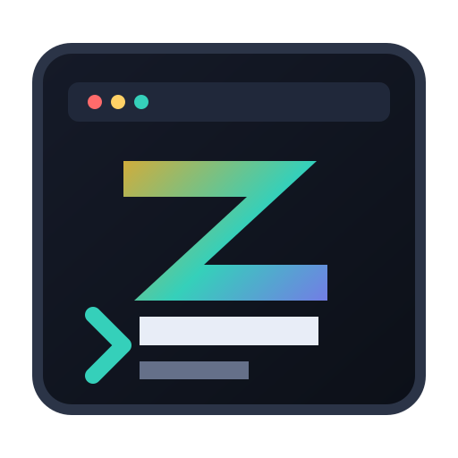
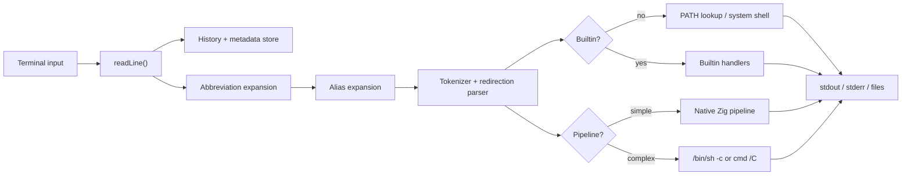
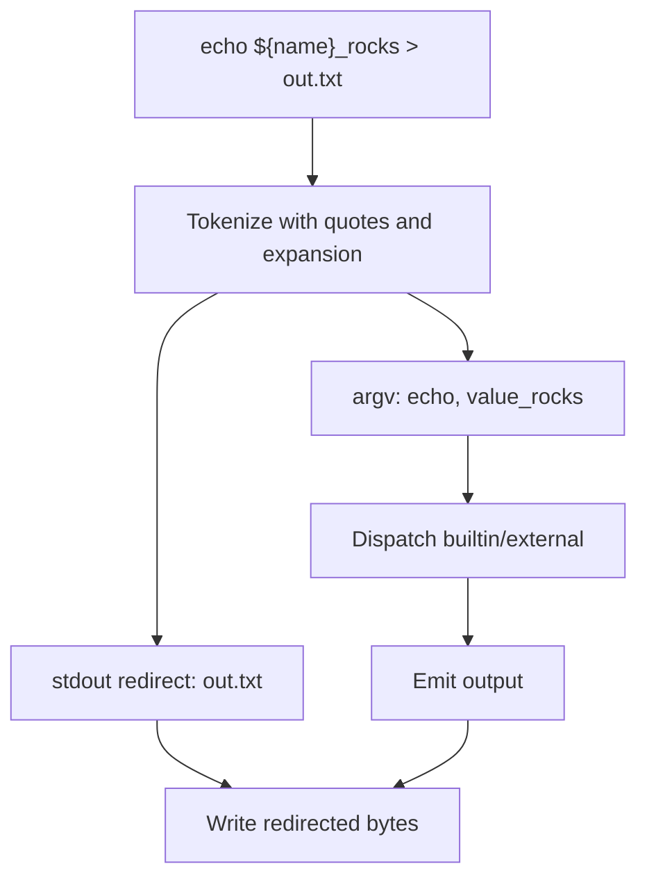
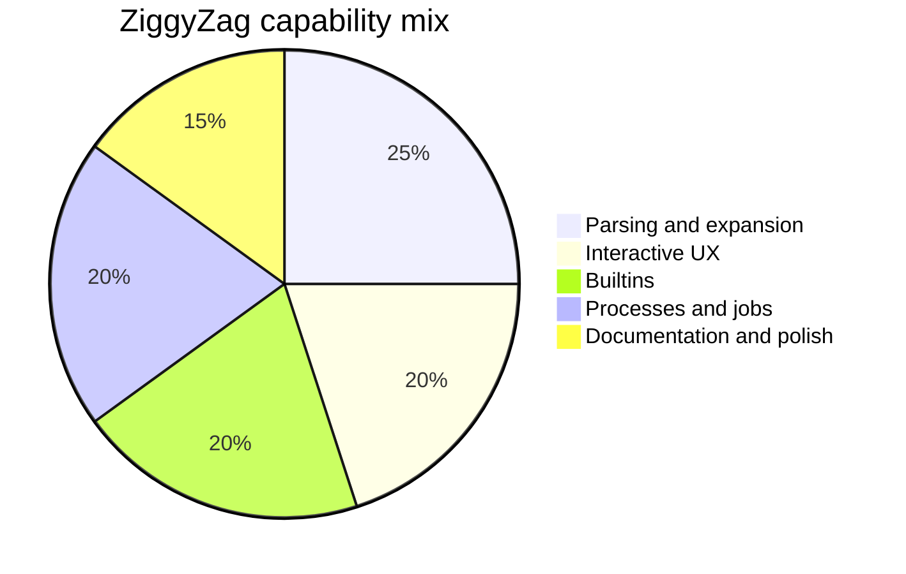

<p align="center">
  
</p>

<h1 align="center">ZiggyZag</h1>

<p align="center">
  A Zig-powered shell playground with real parsing, history, completions, jobs, aliases, abbreviations, smart prompts, and modern shell UX experiments.
</p>

<p align="center">
  <a href="https://github.com/PascalAI2024/ZiggyZag"></a>
  <a href="https://github.com/PascalAI2024/ZiggyZag/actions/workflows/ci.yml"></a>
  
  
  <a href="https://app.codecrafters.io/courses/shell/overview"></a>
</p>

[](https://app.codecrafters.io/users/codecrafters-bot?r=2qF)

ZiggyZag started as a completed CodeCrafters "Build Your Own Shell" project and is now being shaped into a small, readable, hackable shell for people who want to learn how shells work without getting buried in decades of compatibility code.

It is intentionally compact, but it already covers the fundamentals: a REPL, token parsing, quotes, redirection, native simple pipelines, completion, history persistence, metadata history, background jobs, shell variables, parameter expansion, and a few quality-of-life commands for real use.

## Why It Exists

Most shells are either mature production tools with a lot of historical surface area or tiny demos that stop after `echo`. ZiggyZag sits in the middle:

- Small enough to read in one focused sitting.
- Complete enough to demonstrate the hard parts of shell behavior.
- Friendly enough to use as a personal shell lab.
- Written in Zig so memory ownership, process spawning, and terminal behavior stay visible.

## Quick Start

```sh
git clone https://github.com/PascalAI2024/ZiggyZag.git
cd ZiggyZag
zig build
./zig-out/bin/ziggyzag
```

On Windows PowerShell:

```powershell
git clone https://github.com/PascalAI2024/ZiggyZag.git
cd ZiggyZag
zig build
.\zig-out\bin\ziggyzag.exe
```

You can also run the CodeCrafters-compatible wrapper:

```sh
./your_program.sh
```

## Try This

```sh
declare project=ZiggyZag
echo hello_${project}

alias gs='git status --short'
gs

abbr gco='git checkout'
gco main

complete -c zig -a 'build fmt test' -d 'common Zig command'

export EDITOR=vim
echo $EDITOR

which zig
path --json
timeit echo quick
repeat 2 echo again

inspect echo hello | grep hello
doctor
history --search zig
```

## Configuration

ZiggyZag loads startup commands from `$ZIGGYZAG_CONFIG` or `~/.ziggyzagrc`.

```sh
alias gs='git status --short'
abbr gco='git checkout'
complete -c zig -a 'build fmt test' -d 'common Zig command'
prompt smart
export ZIGGYZAG_HISTORY_DB=~/.ziggyzag-history.tsv
```

## Feature Map

| Area | Status | Notes |
| --- | --- | --- |
| REPL prompt | Done | Interactive command loop with manual terminal echo support. |
| Builtins | Done | `about`, `abbr`, `alias`, `cd`, `complete`, `config`, `declare`, `doctor`, `echo`, `env`, `exit`, `export`, `help`, `history`, `inspect`, `jobs`, `mkcd`, `path`, `prompt`, `pwd`, `repeat`, `source`, `timeit`, `type`, `unalias`, `unabbr`, `unset`, `up`, `vars`, `which`. |
| External programs | Done | PATH lookup and process spawning. |
| Quoting | Done | Single quotes, double quotes, and backslash behavior. |
| Redirection | Done | stdout/stderr redirect and append forms. |
| Pipelines | Done | Native simple pipelines with fallback to the system shell for complex syntax. |
| Completion | Done | Builtin, executable, path, programmable, and declarative completion with descriptions. |
| History | Done | Listing, navigation, command recall, fuzzy search, metadata tracking, read/write/append, and `HISTFILE` persistence. |
| Job control | Done | Background jobs, `jobs`, reaping, and job number reuse. |
| Parameter expansion | Done | `$VAR`, `${VAR}`, missing variables, and shell variable storage. |
| Modern UX | Done | Autosuggestion hooks, Ctrl-F accept, Ctrl-R fuzzy recall, syntax highlighting in smart prompt mode, abbreviations, and startup config. |
| Introspection | Done | `about`, `doctor`, `inspect`, `which`, `path`, slash shortcuts, JSON output for jobs/history/prompt/env/doctor, and config validation/reload. |
| Convenience commands | Done | `mkcd`, `up`, `repeat`, `timeit`, `source`, `env`, and `vars`. |
| Developer polish | Done | Repo docs, diagrams, refactors, smoke script, and user-facing enhancements. |

## Architecture





## Capability Mix



## Project Layout

```text
.
|-- assets/
|   `-- ziggyzag-logo.svg
|-- docs/
|   |-- ARCHITECTURE.md
|   |-- FEATURES.md
|   `-- ROADMAP.md
|-- scripts/
|   |-- smoke.sh
|   `-- smoke.ps1
|-- src/
|   `-- main.zig
|-- build.zig
|-- build.zig.zon
|-- your_program.sh
`-- codecrafters.yml
```

## Docs

- [Architecture](docs/ARCHITECTURE.md)
- [Features and roadmap](docs/FEATURES.md)
- [Research-backed roadmap](docs/ROADMAP.md)
- [Contributing](CONTRIBUTING.md)

## Development

Build:

```sh
zig build
```

Run:

```sh
zig build run
```

Format:

```sh
zig fmt src/main.zig
```

Unit tests:

```sh
zig build test
```

Smoke test:

```sh
printf "help\nalias hi='echo hello'\nhi world\nexit\n" | ./zig-out/bin/ziggyzag
```

Feature smoke:

```sh
./scripts/smoke.sh
```

On Windows:

```powershell
.\scripts\smoke.ps1
```

## Roadmap

The first modern shell sprint is in the codebase now. The next wave is about deepening those features while keeping the code readable:

- Cursor-aware autosuggestion UI on every platform.
- Full-screen fuzzy Ctrl-R picker.
- More completion spec shapes for options, files, and dynamic values.
- Real SQLite backend behind the current metadata history format.
- Native pipelines with streaming process pipes and redirection support.
- More parser and execution tests outside the CodeCrafters harness.

See [docs/ROADMAP.md](docs/ROADMAP.md) for feature ideas inspired by fish, zsh, Nushell, PowerShell, Atuin, Starship, and other modern shell tools.

## Credits

Built by [PascalAI2024](https://github.com/PascalAI2024) while completing the CodeCrafters shell challenge, then extended as an open-source learning project.

## License

MIT. See [LICENSE](LICENSE).
