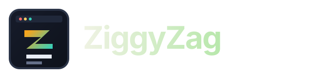
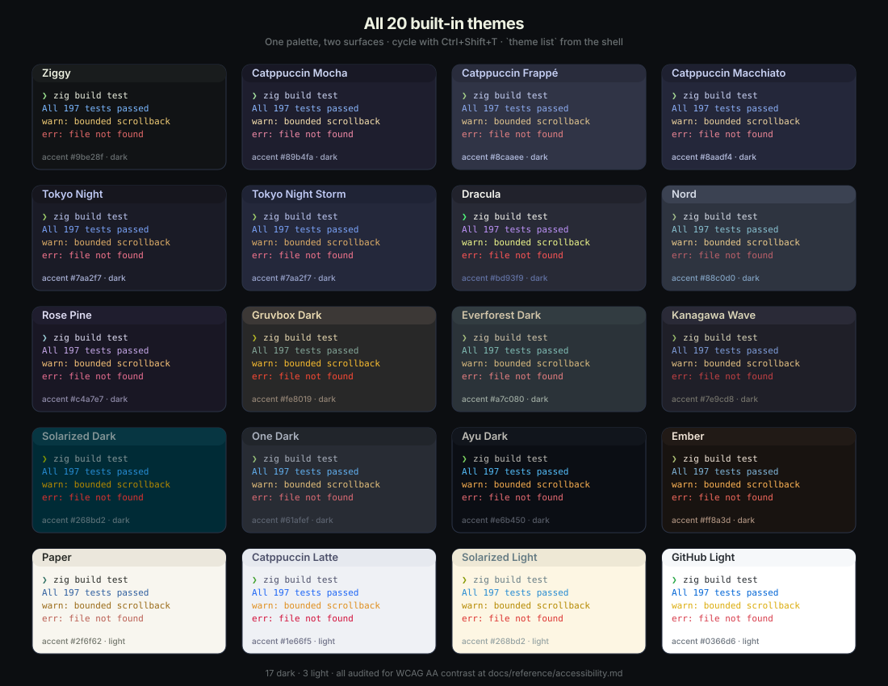
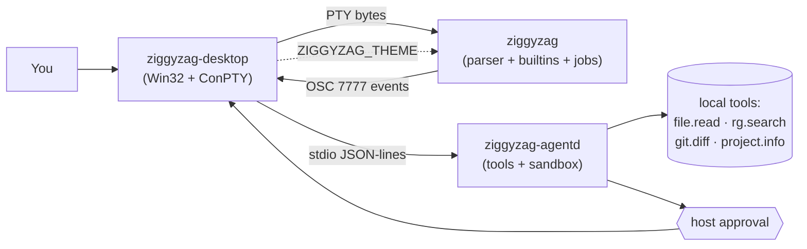
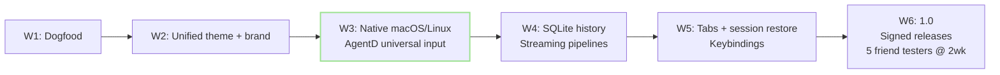

<p align="center">
  
</p>

<p align="center">
  <b>A readable Zig shell, a native Windows terminal host, and a local AI sidecar — sharing themes, events, and approval semantics.</b>
</p>

> **Platform status — read this first.** The native graphical desktop runs on **Windows only** right now (verified working as of 2026-05-17). On **macOS and Linux** you get the shell, AgentD, and a terminal-attached launcher — there is **no native window yet**; native macOS and Linux hosts are in active development (Wave 3). Every screenshot and feature below is Windows unless stated otherwise.

<p align="center">
  <a href="https://github.com/PascalAI2024/ZiggyZag/actions/workflows/ci.yml"></a>
  <a href="https://github.com/PascalAI2024/ZiggyZag/releases"></a>
  
  
  <a href="https://app.codecrafters.io/courses/shell/overview"></a>
</p>

<p align="center">
  
</p>

---

## Install in 60 seconds

```sh
git clone https://github.com/PascalAI2024/ZiggyZag
cd ZiggyZag
zig build
./zig-out/bin/ziggyzag
```

Need [Zig 0.16.0](https://ziglang.org/download/). Prebuilt zips for Windows, Linux, and macOS live on the [releases page](https://github.com/PascalAI2024/ZiggyZag/releases) — install scripts are at [`scripts/install.sh`](scripts/install.sh) and [`scripts/install.ps1`](scripts/install.ps1).

A live landing page is at [**docs/index.html**](docs/index.html) (open it locally or once GitHub Pages is enabled).

## What is in the box

ZiggyZag is one workspace and four binaries that act like a single product:

- **[`apps/shell`](apps/shell/)** — the shell itself. REPL, parser, completion, history, jobs, prompt themes. About 5,600 lines of Zig you can step through.
- **[`apps/desktop`](apps/desktop/README.md)** — the native terminal host. Windows-native Win32/ConPTY with split panes, search, palette, mouse-wheel scrollback, themes, AgentD panel.
- **[`apps/agentd`](apps/agentd/README.md)** — a slim JSON-lines AI sidecar. Approval-aware for any mutation. Sandboxed file reads with realpath containment. Ollama and OpenAI-compatible providers.
- **[`apps/launcher`](apps/launcher/)** — the cross-platform entry point used by release zips.

The shell is the source of truth. The desktop is a host. The agent asks before it acts.

## The headline feature: one theme, two surfaces

Pick a theme in the desktop with `Ctrl+Shift+T`. The terminal palette AND the shell prompt accent move together. Same trick in any external terminal — `export ZIGGYZAG_THEME=tokyo-night` and the prompt follows.

<p align="center">
  
</p>

20 themes ship today: `ziggy`, `catppuccin-mocha`, `catppuccin-frappe`, `catppuccin-macchiato`, `catppuccin-latte`, `tokyo-night`, `tokyo-night-storm`, `dracula`, `nord`, `rose-pine`, `gruvbox-dark`, `everforest-dark`, `kanagawa-wave`, `solarized-dark`, `solarized-light`, `one-dark`, `ayu-dark`, `paper`, `github-light`, `ember`. Spec is in [`docs/reference/theme-protocol.md`](docs/reference/theme-protocol.md). Accessibility audit (WCAG AA contrast across every theme) lives at [`docs/reference/accessibility.md`](docs/reference/accessibility.md). Try `theme list` once running.

## The shape of it

| | |
| --- | --- |
| Zig lines | 18,850 |
| Unit tests | 213 (some skip on non-target platforms) |
| Binaries | 4 |
| Cross-built targets | 5 (windows-x86_64, linux-x86_64, linux-aarch64, macos-x86_64, macos-aarch64) |
| Third-party deps | 0 |
| `@panic` calls | 0 |
| First commit to alpha | 3 days |

## Status — honestly

- **Windows desktop**: alpha. Native Win32 + ConPTY host. The I/O bridge and typed-command execution were structurally broken at the `alpha.3` tag and were fixed 2026-05-17 (four bugs — see [CHANGELOG](CHANGELOG.md) and [`docs/reviews/2026-05-17-windows-debug.md`](docs/reviews/2026-05-17-windows-debug.md)); the host is now empirically drivable. Split panes, palette (`Ctrl+Shift+P`), search (`Ctrl+Shift+F`), quick-select (`Ctrl+Shift+O`), AgentD panel (`Ctrl+Shift+A`), live theme cycle via OSC 7777 (`Ctrl+Shift+T`), settings overlay (`Ctrl+,`).
- **macOS / Linux desktop**: launcher only. Builds the shell, AgentD, and a terminal-attached launcher that prefers the native POSIX PTY relay. Native graphical hosts arrive in Wave 3 — see [`docs/vision/waves.md`](docs/vision/waves.md).
- **Shell**: alpha-ready. 40+ builtins, native simple pipelines (`/bin/sh` fallback for complex), prompt themes (`classic`, `smart`, `compact`, `dev`, `dashboard`), abbreviations, autosuggestions, fuzzy Ctrl-R, history with metadata, project-aware tasks.
- **AgentD**: alpha. Local-only by default. Tool list with approval policies, sandboxed reads, redacted output. Falls back gracefully when no provider is configured.

The full alpha-readiness picture is in [`docs/vision/alpha-tasks.md`](docs/vision/alpha-tasks.md). The strategic direction is in [`docs/vision/masterplan.md`](docs/vision/masterplan.md).

## Docs

| Want to | Read |
| --- | --- |
| Build, run, theme, friend-test | [Quick Start](docs/guides/quick-start.md) |
| Understand the project's north star | [Masterplan](docs/vision/masterplan.md) |
| See what's missing and why | [Alpha Tasks](docs/vision/alpha-tasks.md) |
| Read what we lifted from other tools | [References](docs/vision/references.md) |
| Read the unified theme spec | [Theme Protocol](docs/reference/theme-protocol.md) |
| Read the release plan | [Waves](docs/vision/waves.md) |
| Style something with our tokens | [Brand](docs/reference/brand.md) |
| Look at the system shape | [Architecture](docs/reference/architecture.md) |
| Contribute | [Contributing](CONTRIBUTING.md) · [Tour](docs/guides/contributing-tour.md) |
| Report a security issue | [SECURITY.md](SECURITY.md) |
| See what changed | [CHANGELOG.md](CHANGELOG.md) |
| Read an external review | [docs/reviews/2026-05-17-baseline.md](docs/reviews/2026-05-17-baseline.md) |

App-specific docs: [shell](apps/shell/README.md) · [desktop](apps/desktop/README.md) · [agentd](apps/agentd/README.md).

## Architecture (one diagram)



Three processes, one product. The shell does parsing/execution. The desktop owns the window/grid/palette. The agent suggests and asks. Nothing in the diagram is mocked or aspirational — every arrow runs today. The term↔shell PTY arrow was silently dead until 2026-05-17 (four Windows ConPTY bugs, now fixed — see [CHANGELOG](CHANGELOG.md)); it carries bytes bidirectionally now.

## Roadmap (waves, not dates)



Wave 2 is complete (tagged `v0.1.0-alpha.3`). Wave 3 is the current target. Full gates in [`docs/vision/waves.md`](docs/vision/waves.md).

## Credits

Built by [PascalAI2024](https://github.com/PascalAI2024) while finishing the [CodeCrafters Shell](https://app.codecrafters.io/courses/shell/overview) challenge, then extended into a learning-first open-source project.

References lifted from with respect: [Warp](https://www.warp.dev/), [Ghostty](https://ghostty.org/), [WezTerm](https://wezterm.org/), [fish](https://fishshell.com/), [Starship](https://starship.rs/), and [Atuin](https://atuin.sh/). The full study is at [`docs/vision/references.md`](docs/vision/references.md).

## License

MIT. See [LICENSE](LICENSE).
