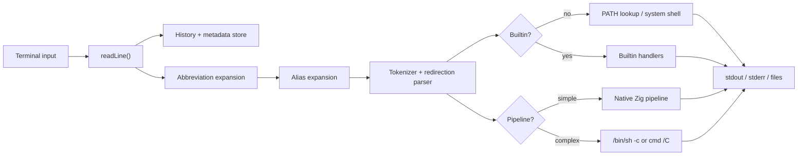
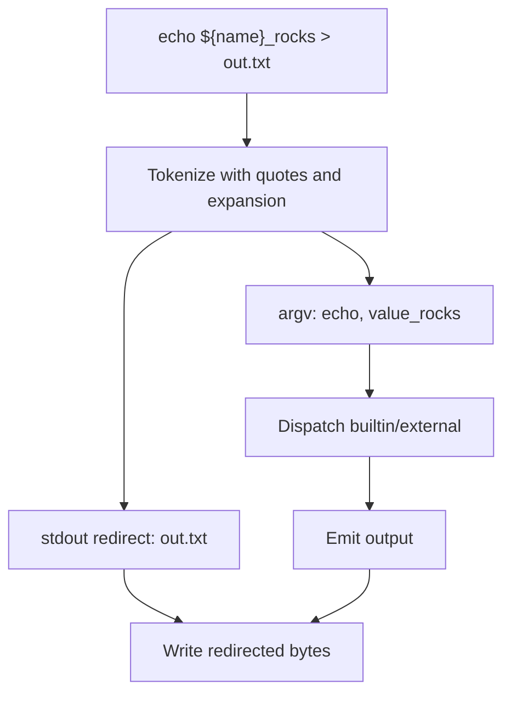
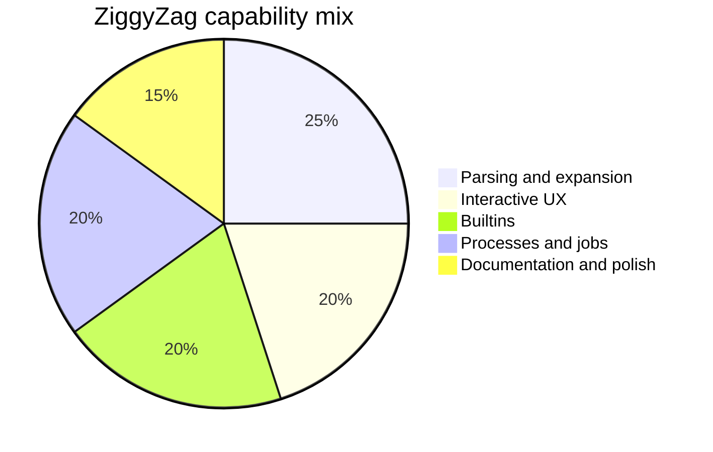

<p align="center">
  
</p>

<h1 align="center">ZiggyZag</h1>

<p align="center">
  A Zig-powered shell workspace with real parsing, history, completions, jobs, aliases, abbreviations, smart prompts, cross-platform shell builds, a Windows-native terminal host, and a slim AI agent sidecar.
</p>

<p align="center">
  <a href="https://github.com/PascalAI2024/ZiggyZag"></a>
  <a href="https://github.com/PascalAI2024/ZiggyZag/actions/workflows/ci.yml"></a>
  
  
  <a href="https://app.codecrafters.io/courses/shell/overview"></a>
</p>

[](https://app.codecrafters.io/users/codecrafters-bot?r=2qF)

ZiggyZag started as a completed CodeCrafters "Build Your Own Shell" project and is now being shaped into a small, readable, hackable shell for people who want to learn how shells work without getting buried in decades of compatibility code.

The repo is now scoped as a workspace: the Zig shell remains the working core, `ziggyzag-agentd` provides a small JSON-lines agent process for terminal-aware assistance experiments, and the desktop lane is Windows-native first with a terminal-attached POSIX launcher for macOS and Linux alpha builds.

It is intentionally compact, but it already covers the fundamentals: a REPL, token parsing, quotes, redirection, native simple pipelines, completion, history persistence, metadata history, background jobs, shell variables, parameter expansion, project-aware tasks, directory navigation, and a few quality-of-life commands for real use.

## Why It Exists

Most shells are either mature production tools with a lot of historical surface area or tiny demos that stop after `echo`. ZiggyZag sits in the middle:

- Small enough to read in one focused sitting.
- Complete enough to demonstrate the hard parts of shell behavior.
- Friendly enough to use as a personal shell lab.
- Written in Zig so memory ownership, process spawning, and terminal behavior stay visible.

## Quick Start

Install [Zig 0.16.0](https://ziglang.org/download/) first. Then build and run from the repository root.

```sh
git clone https://github.com/PascalAI2024/ZiggyZag.git
cd ZiggyZag
zig build
./zig-out/bin/ziggyzag
```

On Windows PowerShell:

```powershell
git clone https://github.com/PascalAI2024/ZiggyZag.git
cd ZiggyZag
zig build
.\zig-out\bin\ziggyzag.exe
```

Run the Windows desktop terminal MVP:

```powershell
zig build run-desktop
```

On macOS/Linux, `zig build run-desktop` currently launches ZiggyZag in the calling terminal through the POSIX desktop entry point. It prefers `script(1)` as a small PTY wrapper and falls back to direct stdio when needed. It does not open a separate native window yet. The shell and AgentD binaries are also first-class alpha artifacts on those platforms:

```sh
zig build
./zig-out/bin/ziggyzag
./zig-out/bin/ziggyzag-agentd --describe-tools
./scripts/smoke.sh
zig build run-desktop
```

Run the agent sidecar tool list:

```powershell
zig build run-agentd -- --describe-tools
```

You can also run the CodeCrafters-compatible wrapper:

```sh
./your_program.sh
```

## Try This

```sh
declare project=ZiggyZag
echo hello_${project}

alias gs='git status --short'
gs

abbr gco='git checkout'
gco main

complete -c zig -a 'build fmt test' -d 'common Zig command'

export EDITOR=vim
echo $EDITOR

which zig
path --json
timeit echo quick
repeat 2 echo again
project
run --list
dirs
history --stats

inspect echo hello | grep hello
doctor
history --search zig
```

## Configuration

ZiggyZag loads startup commands from `$ZIGGYZAG_CONFIG` or `~/.ziggyzagrc`.

```sh
alias gs='git status --short'
abbr gco='git checkout'
complete -c zig -a 'build fmt test' -d 'common Zig command'
prompt smart
export ZIGGYZAG_HISTORY_DB=~/.ziggyzag-history.tsv
```

## Feature Map

| Area | Status | Notes |
| --- | --- | --- |
| REPL prompt | Done | Interactive command loop, smart prompt, terminal title/CWD hints, and manual terminal echo support where raw mode is available. |
| Builtins | Done | `about`, `abbr`, `alias`, `back`, `cd`, `complete`, `config`, `declare`, `dirs`, `doctor`, `echo`, `env`, `exit`, `export`, `forward`, `help`, `history`, `inspect`, `jobs`, `jump`, `mkcd`, `path`, `project`, `prompt`, `pwd`, `repeat`, `run`, `source`, `timeit`, `type`, `unalias`, `unabbr`, `unset`, `up`, `vars`, `which`. |
| External programs | Done | PATH lookup and process spawning. |
| Quoting | Done | Single quotes, double quotes, and backslash behavior. |
| Redirection | Done | stdout/stderr redirect and append forms. |
| Pipelines | Done | Native simple pipelines with fallback to the system shell for complex syntax. |
| Completion | Done | Builtin, executable, path, programmable, and declarative completion with descriptions. |
| History | Done | Listing, navigation, command recall, fuzzy search, failed/slow/cwd/stats queries, metadata tracking, read/write/append, and `HISTFILE` persistence. |
| Job control | Done | Background jobs, `jobs`, reaping, and job number reuse. |
| Parameter expansion | Done | `$VAR`, `${VAR}`, missing variables, and shell variable storage. |
| Modern UX | Done | Cursor-aware line editing, autosuggestion hooks, Ctrl-F accept, Ctrl-R fuzzy recall, syntax highlighting in smart prompt mode, abbreviations, and startup config. |
| Introspection | Done | `about`, `doctor`, `inspect`, `which`, `path`, `project`, slash shortcuts, JSON output for jobs/history/prompt/env/doctor/project/dirs, and config validation/reload. |
| Convenience commands | Done | `mkcd`, `up`, `back`, `forward`, `jump`, `repeat`, `timeit`, `source`, `env`, `vars`, and project-aware `run`. |
| Developer polish | Done | Repo docs, diagrams, refactors, smoke script, and user-facing enhancements. |
| Desktop terminal host | Alpha | Windows-native all-Zig app with Win32 windowing, GDI terminal rendering, ConPTY shell hosting, keyboard input, copy/paste, wheel scrollback, status bar, themes, desktop config parsing, and OSC 777 shell-event parsing. macOS/Linux currently build a terminal-attached launcher that resolves and starts `ziggyzag` through `script(1)` when available; native POSIX graphical hosting is still in progress. |
| Agent runtime | Alpha | Slim `ziggyzag-agentd` binary with JSON-lines protocol, tool descriptions/calls, terminal host actions, and OpenAI-compatible/Ollama request shaping on Windows, macOS, and Linux. |

## Architecture





## Capability Mix



## Project Layout

```text
.
|-- apps/
|   |-- agentd/
|   |   |-- src/
|   |   |   `-- main.zig
|   |   `-- README.md
|   |-- shell/
|   |   `-- src/
|   |       `-- main.zig
|   `-- desktop/
|       |-- src/
|       |   `-- main.zig
|       `-- README.md
|-- apps/desktop-tauri-spike/
|   `-- README_SPIKE.md
|-- assets/
|   `-- ziggyzag-logo.svg
|-- docs/
|   |-- ALL_ZIG_TERMINAL.md
|   |-- ARCHITECTURE.md
|   |-- FEATURES.md
|   |-- QA_TOMORROW.md
|   |-- ROADMAP.md
|   |-- SCOPE.md
|   `-- TERMINAL_APP.md
|-- scripts/
|   |-- qa-tomorrow.ps1
|   |-- smoke.sh
|   `-- smoke.ps1
|-- build.zig
|-- build.zig.zon
|-- your_program.sh
`-- codecrafters.yml
```

## Docs

- [Architecture](docs/ARCHITECTURE.md)
- [Features and roadmap](docs/FEATURES.md)
- [All-Zig terminal direction](docs/ALL_ZIG_TERMINAL.md)
- [Agent runtime](apps/agentd/README.md)
- [Product scope](docs/SCOPE.md)
- [Desktop terminal strategy](docs/TERMINAL_APP.md)
- [Tomorrow QA checklist](docs/QA_TOMORROW.md)
- [Research-backed roadmap](docs/ROADMAP.md)
- [Contributing](CONTRIBUTING.md)

## Release Artifacts

Release packages are produced with:

```powershell
$Version = "v0.1.0-alpha.1"
.\scripts\build-release.ps1 -Version $Version -Optimize ReleaseSafe
.\scripts\qa-release-artifacts.ps1 -Version $Version
```

Expected files under `dist\$Version`:

- `ZiggyZag-$Version-windows-x86_64.zip`
- `ZiggyZag-$Version-linux-x86_64.zip`
- `ZiggyZag-$Version-linux-aarch64.zip`
- `ZiggyZag-$Version-macos-x86_64.zip`
- `ZiggyZag-$Version-macos-aarch64.zip`
- `checksums.sha256`
- `release-manifest.json`

Every zip contains `bin/ziggyzag`, `bin/ziggyzag-agentd`, `bin/ziggyzag-desktop`, plus `README.md` and `LICENSE`; Windows binaries use the `.exe` suffix. Use `checksums.sha256` to verify downloads before testing. The archive QA script expands each zip, checks expected binaries and binary headers, and runs extracted Windows shell, AgentD, and desktop smoke tests. Linux/macOS runtime smokes still need real Linux/macOS hosts or CI runners.

## Development

Build:

```sh
zig build
```

Run:

```sh
zig build run
```

Run the all-Zig desktop target:

```sh
zig build run-desktop
```

Platform behavior:

- Windows: opens the native terminal host and launches `ziggyzag` through ConPTY.
- macOS/Linux: launches `ziggyzag` in the calling terminal after resolving the shell path; it uses `script(1)` as a PTY wrapper when available, can be forced to direct stdio with `ZIGGYZAG_DESKTOP_NO_PTY=1`, and does not open a separate graphical window yet.

Run the Zig-native agent runtime:

```sh
zig build run-agentd -- --describe-tools
zig build run-agentd -- --stdio
```

Format:

```sh
zig fmt apps/shell/src/main.zig apps/desktop/src/main.zig apps/desktop/src/lib.zig apps/desktop/src/integration.zig apps/desktop/src/terminal.zig apps/desktop/src/theme.zig apps/desktop/src/config.zig apps/desktop/src/pty.zig apps/desktop/src/windows_app.zig apps/agentd/src/main.zig apps/agentd/src/lib.zig apps/agentd/src/protocol.zig apps/agentd/src/provider.zig apps/agentd/src/tools.zig build.zig
```

Unit tests:

```sh
zig build test
```

Smoke test:

```sh
printf "help\nalias hi='echo hello'\nhi world\nexit\n" | ./zig-out/bin/ziggyzag
```

Feature smoke:

```sh
./scripts/smoke.sh
```

On Windows:

```powershell
.\scripts\smoke.ps1
```

For normal desktop testing today, use the all-Zig Windows app. On macOS/Linux, test the shell, AgentD, smoke script, and terminal-attached desktop launcher. The Tauri/xterm.js version is preserved only as a spike under `apps/desktop-tauri-spike`. See [docs/ALL_ZIG_TERMINAL.md](docs/ALL_ZIG_TERMINAL.md).

## Friend Test Checklist

For a quick Windows test session tomorrow, use this order:

1. Install Zig 0.16.0 and confirm `zig version` prints `0.16.0`.
2. Run `zig build`.
3. Run `.\scripts\qa-tomorrow.ps1` on Windows for the full scripted pass.
4. Run `.\zig-out\bin\ziggyzag.exe` and try `help`, `doctor`, `history --stats`, `project`, and `exit`.
5. Run `.\scripts\smoke.ps1`.
6. Run `zig build run-desktop` and test typing, Enter, Backspace, Ctrl+C interrupt, Ctrl+V paste, Shift+Insert paste, Ctrl+Shift+C copy-visible text, window resize, and mouse-wheel scrollback.
7. Run `zig build run-agentd -- --describe-tools` and confirm the JSON tool list includes `project.info`, `file.read`, `rg.search`, `git.diff`, `zig.build`, and `terminal.write`.
8. Run `zig build run-agentd -- --stdio` and send `{"id":1,"method":"agent/health"}` to confirm AgentD reports provider readiness.
9. If Ollama is installed, start it separately and try `zig build run-agentd -- --oneshot "summarize this workspace"`.

For macOS/Linux alpha testing:

1. Install Zig 0.16.0 and confirm `zig version` prints `0.16.0`.
2. Run `zig build`.
3. Run `./scripts/smoke.sh`.
4. Run `./zig-out/bin/ziggyzag` and try `help`, `doctor`, `history --stats`, `project`, and `exit`.
5. Run `./zig-out/bin/ziggyzag-agentd --describe-tools`.
6. Run `printf '%s\n' '{"id":1,"method":"agent/health"}' | ./zig-out/bin/ziggyzag-agentd --stdio`.
7. Run `zig build run-desktop`, confirm it launches ZiggyZag in the current terminal, then type `exit` to return. A native desktop window is not expected yet.

## Troubleshooting

| Symptom | Fix |
| --- | --- |
| `zig` is not recognized | Install Zig 0.16.0 and open a fresh terminal, or add the Zig folder to `PATH`. On Windows, `winget install zig.zig` is usually enough. |
| `.\zig-out\bin\ziggyzag.exe` is missing | Run `zig build` from the repo root first. |
| `.\scripts\smoke.ps1` says the binary is missing | Run `zig build`, then rerun the smoke script from the repo root. |
| Desktop window opens but shell does not start | Confirm `zig-out\bin\ziggyzag.exe` exists and that antivirus did not quarantine a local build artifact. |
| macOS/Linux `zig build run-desktop` does not open a window | Expected for this alpha. It should launch ZiggyZag in the current terminal through `script(1)` when available; use `./zig-out/bin/ziggyzag` directly if you do not want the launcher banner. |
| AgentD returns `provider_error` from `--oneshot` or `agent/run` | This is expected when Ollama or the configured OpenAI-compatible provider is not running. Tool listing, `agent/health`, and local tool calls should still work. |
| Ollama request fails | Start Ollama, confirm `http://127.0.0.1:11434` is reachable, and set `ZIGGYZAG_AGENT_MODEL` to a local model you have pulled. |

## Roadmap

The first modern shell sprint is in the codebase now. The next wave is about deepening those features while keeping the code readable:

- Cursor-aware autosuggestion UI on every platform.
- Hardening the first-party Zig-native desktop terminal host that runs ZiggyZag through Windows ConPTY.
- Expanding the shared theme and shell-integration protocol between the shell and terminal app.
- Full-screen fuzzy Ctrl-R picker.
- More completion spec shapes for options, files, and dynamic values.
- Real SQLite backend behind the current metadata history format.
- Native pipelines with streaming process pipes and redirection support.
- More parser and execution tests outside the CodeCrafters harness.

See [docs/ROADMAP.md](docs/ROADMAP.md) for feature ideas inspired by fish, zsh, Nushell, PowerShell, Atuin, Starship, and other modern shell tools.

## Credits

Built by [PascalAI2024](https://github.com/PascalAI2024) while completing the CodeCrafters shell challenge, then extended as an open-source learning project.

## License

MIT. See [LICENSE](LICENSE).
