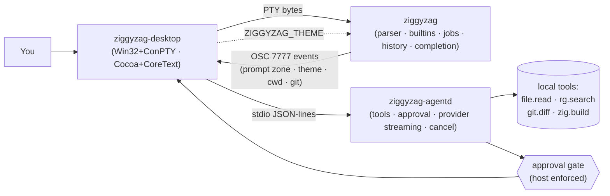
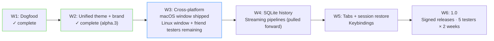

<p align="center">
  
</p>

<p align="center">
  <b>A readable Zig shell, a native terminal host for Windows and macOS, and a local AI sidecar — sharing themes, events, and approval semantics.</b>
</p>

<p align="center">
  <a href="https://github.com/PascalAI2024/ZiggyZag/actions/workflows/ci.yml"></a>
  <a href="https://github.com/PascalAI2024/ZiggyZag/releases"></a>
  
  
</p>

<p align="center">
  
</p>

> **Platform status — read this first.** Windows (verified 2026-05-17): Win32/ConPTY host with split panes, search, AgentD panel. macOS (verified 2026-06-10): native Cocoa window via `ZIGGYZAG_NATIVE_WINDOW=1` — CoreText grid renderer, dynamic resize, mouse-wheel scrollback, command palette, scrollback search, quick select, settings overlay, theme cycling with live OSC 7777 broadcast, copy visible text (`Cmd+Shift+C`), Cmd+V paste, application-cursor arrows, semantic prompt zones, prompt-jump navigation (`Cmd+Up/Down`), mouse selection with double/triple-click, and AgentD universal input (`Ctrl+Space`). Linux: shell + launcher; native window planned next wave.

---

## Install in 60 seconds

```sh
git clone https://github.com/PascalAI2024/ZiggyZag
cd ZiggyZag
zig build
./zig-out/bin/ziggyzag
```

Requires [Zig 0.16.0](https://ziglang.org/download/). Prebuilt zips for Windows, Linux, and macOS live on the [releases page](https://github.com/PascalAI2024/ZiggyZag/releases). Install scripts: [`scripts/install.sh`](scripts/install.sh) and [`scripts/install.ps1`](scripts/install.ps1).

To open the macOS native window:
```sh
ZIGGYZAG_NATIVE_WINDOW=1 ./zig-out/bin/ziggyzag-desktop
```

To build the `.app` bundle:
```sh
zig build bundle
```

---

## What is in the box

ZiggyZag is one workspace and four binaries that act like a single product:

- **[`apps/shell`](apps/shell/)** — the shell itself. REPL, parser, completion, history, jobs, prompt themes, syntax highlighting. ~7,700 lines of Zig.
- **[`apps/desktop`](apps/desktop/README.md)** — the native terminal host. Windows (Win32/ConPTY) and macOS (Cocoa/CoreText). Command palette, search, quick select, theme cycling, AgentD universal input, split panes (Windows), semantic prompt zones, mouse selection, scrollback.
- **[`apps/agentd`](apps/agentd/README.md)** — a slim JSON-lines AI sidecar. Approval-aware for every mutation. Sandboxed file reads with realpath containment. Ollama and OpenAI-compatible providers.
- **[`apps/launcher`](apps/launcher/)** — the cross-platform entry point used by release zips.

The shell is the source of truth. The desktop is a host. The agent asks before it acts.

---

## Feature matrix

| Feature | Shell | macOS desktop | Windows desktop |
| --- | :---: | :---: | :---: |
| Fish-grade syntax highlighting | ✓ | — | — |
| Cursor-aware completion v2 (quoted/escaped paths) | ✓ | — | — |
| Durable history (TSV, secret redaction, 16 patterns) | ✓ | — | — |
| 40+ builtins, abbreviations, autosuggestions | ✓ | — | — |
| Fuzzy Ctrl-R history search | ✓ | — | — |
| Five prompt themes | ✓ | — | — |
| Streaming OS pipe-chain pipelines | ✓ | — | — |
| Native window (Cocoa/CoreText) | — | ✓ | — |
| Native window (Win32/ConPTY) | — | — | ✓ |
| Unicode/grapheme cell model (wide, zero-width, astral) | — | ✓ | ✓ |
| SGR render attributes + 256/truecolor | — | ✓ | ✓ |
| Semantic prompt zones + prompt-jump (Cmd+Up/Down) | — | ✓ | — |
| Mouse selection + double/triple-click + Cmd+C copy | — | ✓ | — |
| Dynamic resize + mouse-wheel scrollback | — | ✓ | ✓ |
| Command palette (Ctrl+Shift+P) | — | ✓ | ✓ |
| Scrollback search (Ctrl+Shift+F) | — | ✓ | ✓ |
| Quick select (Ctrl+Shift+O) | — | ✓ | ✓ |
| Settings overlay (Ctrl+,) | — | ✓ | ✓ |
| 20-theme cycle with live OSC 7777 broadcast | — | ✓ | ✓ |
| ZiggyZag.app bundle (`zig build bundle`) | — | ✓ | — |
| AgentD universal input (Ctrl+Space) | — | ✓ | ✓ |
| AgentD approval gate before terminal writes | ✓ | ✓ | ✓ |
| AgentD cancel protocol | ✓ | ✓ | ✓ |
| Split panes | — | — | ✓ |
| VT conformance harness (15/15 cases) | ✓ | — | — |
| CI headless smoke test | ✓ | ✓ | ✓ |

---

## The headline feature: one theme, two surfaces

Pick a theme in the desktop with `Ctrl+Shift+T`. The terminal palette AND the shell prompt accent move together via OSC 7777. Same trick in any external terminal — `export ZIGGYZAG_THEME=tokyo-night` and the prompt follows.

<p align="center">
  
</p>

20 themes ship today: `ziggy`, `catppuccin-mocha`, `catppuccin-frappe`, `catppuccin-macchiato`, `catppuccin-latte`, `tokyo-night`, `tokyo-night-storm`, `dracula`, `nord`, `rose-pine`, `gruvbox-dark`, `everforest-dark`, `kanagawa-wave`, `solarized-dark`, `solarized-light`, `one-dark`, `ayu-dark`, `paper`, `github-light`, `ember`. Full spec at [`docs/reference/theme-protocol.md`](docs/reference/theme-protocol.md). WCAG AA contrast audit at [`docs/reference/accessibility.md`](docs/reference/accessibility.md). Try `theme list` once running.

---

## Architecture



Three processes, one product. The shell handles parsing and execution. The desktop owns the window, grid, and palette. The agent suggests and waits for approval before any write reaches the PTY. Every arrow in this diagram runs today on both Windows and macOS.

---

## Engineering highlights

These are the things a hiring engineer might want to look at.

**All-Zig, zero dependencies.** The entire product — shell, terminal emulator, AI sidecar — is written in Zig 0.16.0 with no third-party packages. One `zig build` command produces all four binaries from a cold clone.

**Three-process architecture.** Shell, desktop, and agent are separate OS processes communicating via PTY bytes (shell ↔ desktop) and stdio JSON-lines (desktop ↔ agentd). Each component is independently testable, replaceable, and readable in a focused sitting.

**VT conformance gate in CI.** A purpose-built conformance harness binary (`zig build vt-conformance`) runs 15 VT test cases covering CSI/SGR parsing, cursor state, scroll regions, alternate screen, and malformed escape recovery. All 15 pass. This gate runs in CI on every push.

**Approval-gated AI writes.** The agent process never writes to the terminal directly. Every `terminal.write` or `zig.build` action emits a structured intent payload; the desktop host renders a preview card, waits for explicit keyboard approval (`Y`/`N`), and only then performs the action. The approval policy is declared per-tool as data, not enforced by convention.

**Streaming pipelines with deadlock regression test.** Native OS pipe chains connect pipeline stages (replacing the earlier buffered-temp approach). A deadlock regression test covering the classic "both ends blocking" case is wired into the CI test suite.

**Durable history on by default.** The shell persists command metadata (cwd, exit status, duration, timestamps) to a TSV backend across sessions. 16 secret-redaction patterns scrub API tokens, PEM blocks, and password flags before anything hits disk. Import/export round-trips are tested.

**Unicode/grapheme cell model.** The terminal grid stores Unicode scalars, handles UTF-8 decode with invalid-byte replacement, tracks wide-cell continuations for CJK and emoji, and preserves zero-width combining marks in the correct cell. The grapheme model is tested independently of the renderer.

**~220 unit tests across 4 binaries.** Tests live next to the code they cover, run on all three CI platforms (Windows, Linux, macOS), and include property-like cases for the VT parser state machine, history backend, config round-trips, and AgentD protocol.

---

## The shape of it

| | |
| --- | --- |
| Zig source lines | ~25,100 |
| Unit tests | ~220 (some skip on non-target platforms) |
| Binaries | 4 |
| Cross-built targets | 5 (windows-x86_64, linux-x86_64, linux-aarch64, macos-x86_64, macos-aarch64) |
| Third-party deps | 0 |
| `@panic` calls | 0 |
| VT conformance harness | 15/15 |

---

## Status — honestly

- **Windows desktop**: alpha. Native Win32 + ConPTY host. Split panes, command palette, search, quick-select, AgentD panel, live theme cycle, settings overlay. I/O bridge bugs fixed 2026-05-17.
- **macOS desktop**: alpha. Native Cocoa window (NSWindow + NSView + CoreText/CoreGraphics). Activate with `ZIGGYZAG_NATIVE_WINDOW=1`. Full feature set including semantic prompt zones, mouse selection, SGR 256/truecolor, Unicode/grapheme model, and AgentD universal input.
- **Linux desktop**: launcher only. POSIX PTY relay; native window in the next wave.
- **Shell**: alpha-ready. 40+ builtins, streaming pipelines, prompt themes, syntax highlighting, abbreviations, autosuggestions, fuzzy Ctrl-R, durable history, and cursor-aware completions.
- **AgentD**: alpha. Local-only by default. Approval gate, tool schemas, bounded sandboxed reads, cancel protocol, provider streaming. Falls back gracefully when no provider is configured.

Full alpha-readiness picture: [`docs/vision/alpha-tasks.md`](docs/vision/alpha-tasks.md). Strategic direction: [`docs/vision/masterplan.md`](docs/vision/masterplan.md).

---

## Roadmap (waves, not dates)



Wave 3 is the current wave. The macOS native window shipped 2026-06-10; Linux native window and friend-tester cohort remain to close the wave. Several Wave 4 features (streaming pipelines, durable history, VT conformance harness) were pulled forward and already shipped. Full gates in [`docs/vision/waves.md`](docs/vision/waves.md).

---

## Docs

| Want to | Read |
| --- | --- |
| Build, run, theme, friend-test | [Quick Start](docs/guides/quick-start.md) |
| Understand the project's north star | [Masterplan](docs/vision/masterplan.md) |
| See what's missing and why | [Alpha Tasks](docs/vision/alpha-tasks.md) |
| Read what we lifted from other tools | [References](docs/vision/references.md) |
| Read the unified theme spec | [Theme Protocol](docs/reference/theme-protocol.md) |
| Read the release plan | [Waves](docs/vision/waves.md) |
| Look at the system shape | [Architecture](docs/reference/architecture.md) |
| Contribute | [Contributing](CONTRIBUTING.md) · [Tour](docs/guides/contributing-tour.md) |
| Report a security issue | [SECURITY.md](SECURITY.md) |
| See what changed | [CHANGELOG.md](CHANGELOG.md) |

App-specific docs: [shell](apps/shell/README.md) · [desktop](apps/desktop/README.md) · [agentd](apps/agentd/README.md).

---

## Credits

Built by [PascalAI2024](https://github.com/PascalAI2024) while finishing the [CodeCrafters Shell](https://app.codecrafters.io/courses/shell/overview) challenge, then extended into a learning-first open-source project. The shell, terminal emulator, and agent are all original Zig.

Inspirations (ideas only — all code is original): [Fish](https://fishshell.com/) (shell UX), [Ghostty](https://ghostty.org/) (terminal correctness), [Warp](https://www.warp.dev/) (AI terminal model), [WezTerm](https://wezterm.org/), [Starship](https://starship.rs/), [Atuin](https://atuin.sh/). Full study: [`docs/vision/references.md`](docs/vision/references.md).

Development was assisted by a multi-agent AI workflow (Claude Code + J.A.R.V.I.S. orchestration), with all architecture decisions, code review, and correctness calls made by the human author.

---

## License

MIT. See [LICENSE](LICENSE).
