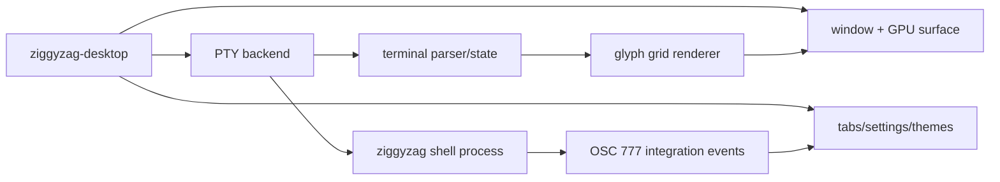

# All-Zig Terminal Direction

ZiggyZag can be a Zig shell inside a Zig-native terminal host. This is the strongest long-term identity for the project: one language, one build story, and terminal behavior that remains visible instead of being hidden behind a webview.

The existing Tauri scaffold is useful as a product spike, but the primary direction is the all-Zig desktop terminal.

## Why Pivot

| Choice | Benefit | Cost |
| --- | --- | --- |
| Tauri + xterm.js | Fastest path to a polished app surface. | Splits the product across Zig, Rust, TypeScript, CSS, webview APIs, and xterm.js. |
| All Zig | Strong identity, direct control, simpler mental model for this repo. | More systems work: PTY, rendering, input, clipboard, font shaping, and terminal correctness. |

The all-Zig path is harder, but it fits the reason ZiggyZag exists: learning and owning the machinery.

## Reference Projects

- [Ghostty](https://github.com/ghostty-org/ghostty): terminal emulator with Zig core, native UI strategy, GPU acceleration, and embeddable terminal libraries.
- [Ghostling](https://github.com/ghostty-org/ghostling): minimal terminal built on top of `libghostty`.
- [Mach](https://machengine.org/docs): Zig graphics/windowing direction to watch, though still experimental.

Do not clone these wholesale. Use them as proof that the architecture is viable and as references for the hard parts.

## Proposed Architecture



## Components

| Component | First Step | Long-Term Shape |
| --- | --- | --- |
| PTY | Done on Windows with ConPTY. POSIX PTY second. | Shared Zig abstraction for spawning shells, resizing, reading, writing, and process cleanup. |
| Terminal parser | Minimal ANSI/xterm subset implemented for MVP, including SGR style state for the local grid. | Use or integrate `libghostty-vt` when versioning and packaging are understood. |
| Renderer | Native Win32 + GDI grid renderer implemented for MVP. | GPU renderer with Unicode width, selections, cursor styles, ligatures, and image protocol decisions. |
| UI | One native window, status bar, copy/paste, and wheel scrollback implemented. | Command palette, tabs, split panes, themes, search, selection copy, profile management. |
| Shell integration | Existing OSC 777 events. | Versioned event stream plus optional sidecar IPC for larger payloads. |

## MVP

1. Done: build a Zig executable named `ziggyzag-desktop`.
2. Done: launch `zig-out/bin/ziggyzag` through Windows ConPTY.
3. Done: read PTY output and render a terminal grid in a native Win32 window.
4. Done: send keyboard input back to the PTY.
5. Partial: resize, themes, paste, Ctrl+C interrupt, Ctrl+Shift+C copy-visible, and wheel scrollback are in; mouse selection and deeper terminal correctness remain.
6. Done: parse ZiggyZag OSC 777 events for cwd, command status, duration, and shell readiness.

## Repo Plan

```text
apps/
|-- shell/
|   `-- src/main.zig
|-- desktop/
|   `-- src/main.zig
`-- desktop-tauri-spike/
    `-- ...
```

`apps/desktop` is the all-Zig app lane. The Tauri implementation is preserved under `apps/desktop-tauri-spike` only as a reference spike and is not required for normal desktop testing.

## Open Technical Decisions

- Windowing/rendering: direct Win32/GDI is the current MVP; Mach, SDL, GLFW, or a GPU path remain later options.
- Terminal core: incremental local parser first or `libghostty-vt` first.
- Font stack: platform text APIs first or bundled FreeType/HarfBuzz-style stack.
- Windows-first vs cross-platform from day one.
- Whether the desktop binary links shell code directly or launches the shell executable through a PTY. The PTY process boundary is preferred for correctness and compatibility.

## Near-Term Sequence

1. Done: keep shell integration events in `apps/shell`.
2. Done: move the Tauri scaffold out of the primary `apps/desktop` lane.
3. Done: create a tested Zig desktop foundation with terminal grid, event extraction, themes, and PTY backend selection.
4. Done: add PTY read/write on Windows.
5. Done: open a native window and render the terminal grid.
6. Next: harden user-facing details for testers: selection, config loading, ANSI coverage, lifecycle cleanup, and an agent side panel.
7. Decide whether to pull in `libghostty-vt` once the local MVP proves the app boundary.
