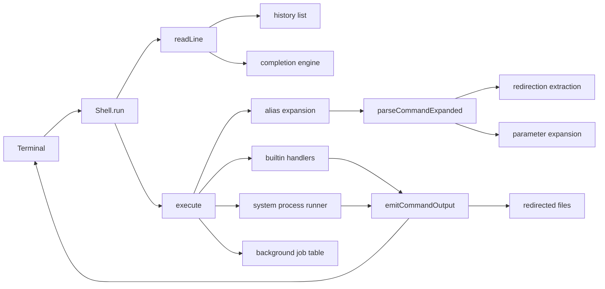
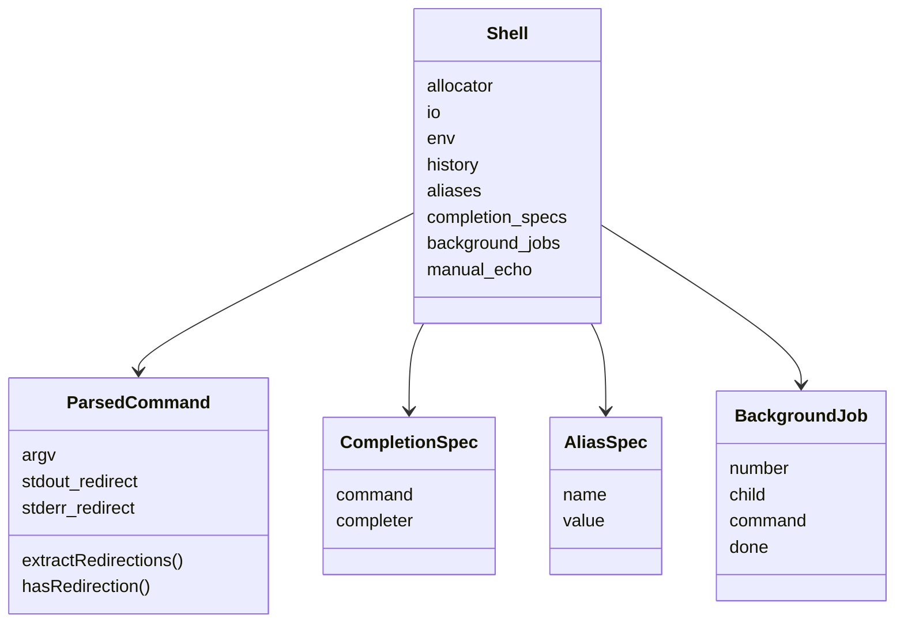

# Architecture

ZiggyZag is intentionally compact: most behavior lives in `src/main.zig`, with small structs for shell state, parsed commands, completion specs, aliases, and background jobs. That makes the project easy to step through while still showing real shell concerns.

## Runtime Schematic

## Command Lifecycle

1. The REPL prints a prompt and reads bytes from stdin.
2. Terminal editing handles tabs, backspace, and Up/Down history navigation.
3. Non-empty commands are stored in history.
4. Aliases expand the first command word once.
5. The parser tokenizes quotes, escapes, redirection operators, and `$VAR` or `${VAR}` expansion.
6. Builtins execute directly in-process.
7. Pipelines and general external command forms delegate to the system shell.
8. Background jobs are tracked and reaped before later prompts.
9. stdout/stderr are emitted or redirected.

## Core State

## Why Some Work Is Delegated

Pipelines currently use `/bin/sh -c` on POSIX and `cmd /C` on Windows. That keeps the project small and lets the shell focus on interactive behavior, builtins, parsing, history, and expansion. A future native pipeline engine would be a strong next refactor.

## Design Rules

- Keep the default prompt and core output stable for CodeCrafters compatibility.
- Prefer small helper functions over hidden framework magic.
- Keep feature behavior readable before making it clever.
- Make every added UX feature teach a shell concept.
