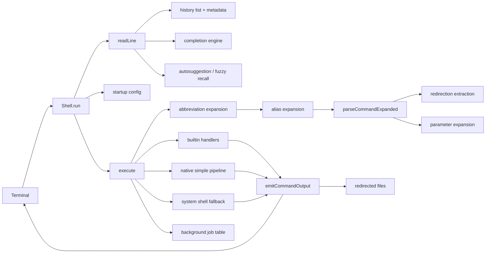
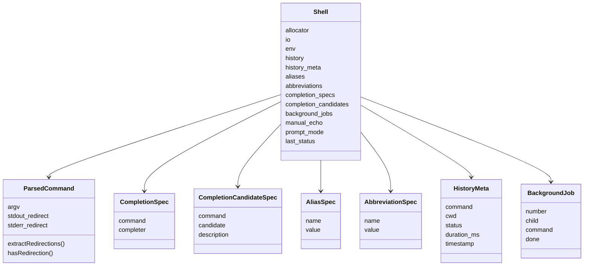

# Architecture

ZiggyZag is intentionally compact: most behavior lives in `src/main.zig`, with small structs for shell state, parsed commands, completion specs, aliases, abbreviations, history metadata, and background jobs. That makes the project easy to step through while still showing real shell concerns.

## Runtime Schematic

## Command Lifecycle

1. The REPL prints a prompt and reads bytes from stdin.
2. Startup config can register aliases, abbreviations, completions, exports, and prompt mode.
3. Terminal editing handles tabs, backspace, Up/Down history navigation, Ctrl-F autosuggestion accept, and Ctrl-R fuzzy recall.
4. Non-empty commands are stored in history, and execution metadata is recorded.
5. Abbreviations and aliases expand the first command word once.
6. The parser tokenizes quotes, escapes, redirection operators, and `$VAR` or `${VAR}` expansion.
7. Builtins execute directly in-process.
8. Simple pipelines run through the native Zig pipeline path; complex shell syntax falls back to the platform shell.
9. Background jobs are tracked and reaped before later prompts.
10. stdout/stderr are emitted or redirected.

## Core State

## Why Some Work Is Delegated

Simple pipelines now have a native Zig path. Complex syntax still uses `/bin/sh -c` on POSIX and `cmd /C` on Windows. That keeps the project small while leaving room for a deeper streaming pipeline engine later.

## Design Rules

- Keep the default prompt and core output stable for CodeCrafters compatibility.
- Prefer small helper functions over hidden framework magic.
- Keep feature behavior readable before making it clever.
- Make every added UX feature teach a shell concept.
