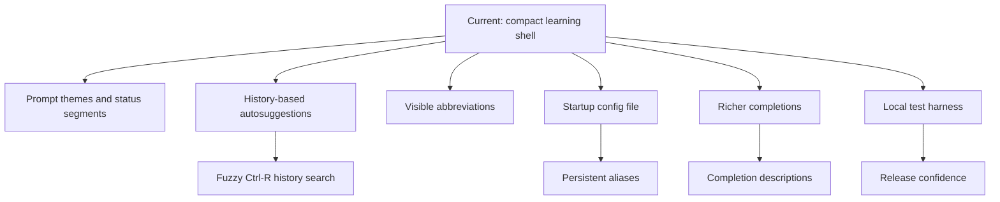
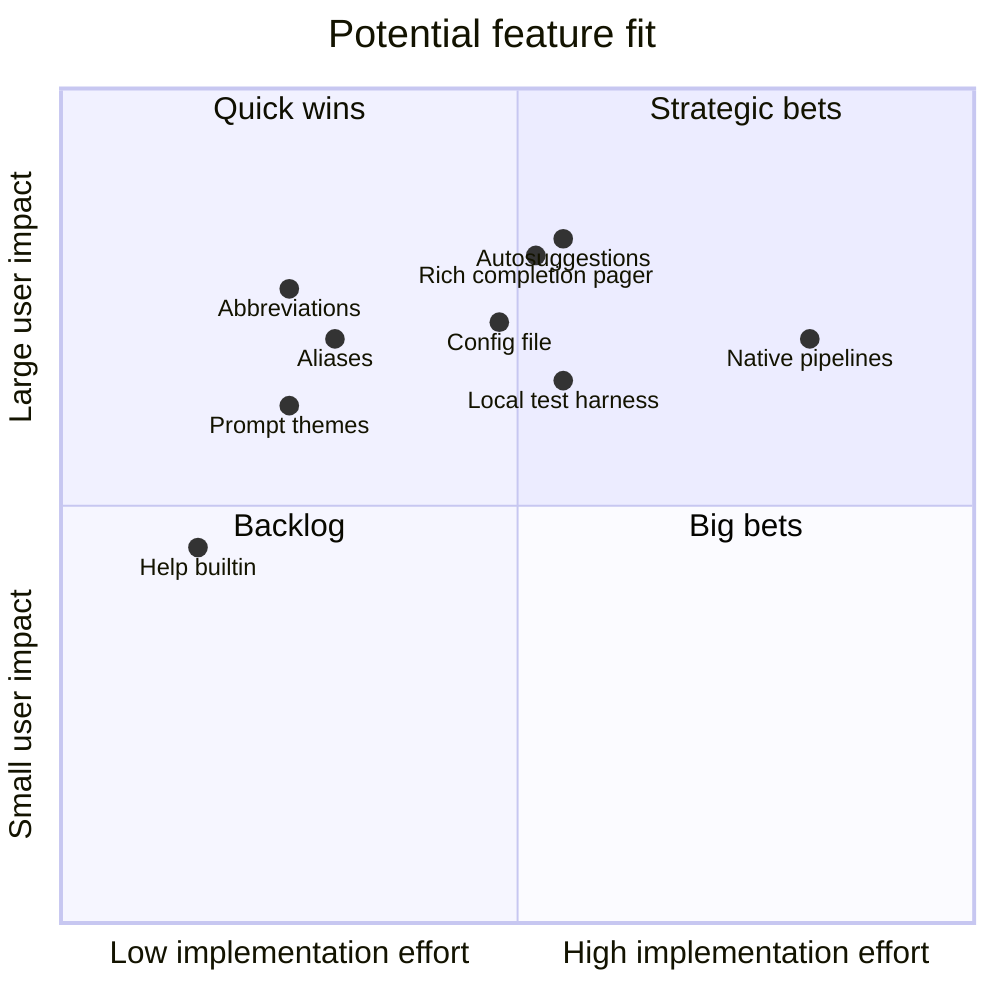

# Features And Roadmap

This file tracks what ZiggyZag already does and what would make it more useful as an everyday shell experiment.

## Completed Capabilities

| Capability | Details |
| --- | --- |
| Interactive REPL | Prompt loop, command input, terminal mode, manual echo handling. |
| Builtins | `echo`, `exit`, `type`, `pwd`, `cd`, `history`, `declare`, `jobs`, `complete`, `help`, `alias`, `unalias`, `export`, `unset`. |
| Command lookup | PATH search and executable detection. |
| Quoting | Single quotes, double quotes, and backslash handling. |
| Redirection | stdout/stderr redirect and append. |
| Completion | Builtin completion, executable completion, path completion, and programmable completion. |
| History | Listing, limits, Up/Down navigation, command recall, read/write/append, startup and exit persistence. |
| Jobs | Background execution, `jobs`, job number reuse, and reaping. |
| Variables | `declare`, validation, `$VAR`, `${VAR}`, and unset expansion behavior. |
| Repo polish | Logo, diagrams, public docs, contribution notes, and a project-named binary. |

## User Experience Roadmap

## Engineering Roadmap

| Priority | Feature | Why it matters | Size |
| --- | --- | --- | --- |
| 1 | Autosuggestions | Makes the shell feel modern and fast. | M |
| 2 | Rich completion pager | Adds discoverable flags, paths, and command descriptions. | M |
| 3 | Abbreviations | Expands shortcuts before execution so history stays readable. | S |
| 4 | Config file | Makes aliases, prompt settings, and startup commands persistent. | M |
| 5 | Native pipelines | Removes system-shell delegation and teaches process pipes directly. | L |
| 6 | Structured tests | Keeps open-source contributions safe. | M |
| 7 | Prompt customization | Lets users make ZiggyZag feel personal. | S |
| 8 | Better diagnostics | Clear parser errors make the shell easier to learn from. | S |
| 9 | Release builds | Tagged binaries make the repo easier to try. | M |

## Feature Shape

For the longer research list and source links, see [ROADMAP.md](ROADMAP.md).

## Open Questions

- Should ZiggyZag stay a learning shell or grow toward daily-driver use?
- Should shell variables and exported environment variables be split into separate stores?
- Should pipelines be parsed and executed natively before adding more UX features?
- Should the config format be shell-like, TOML, or a tiny ZiggyZag-specific format?
