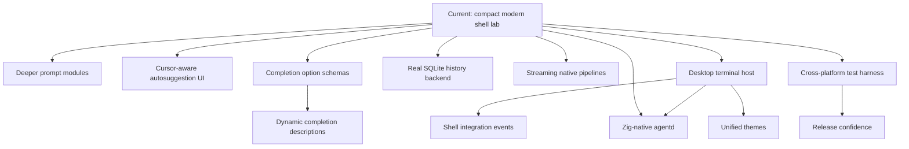
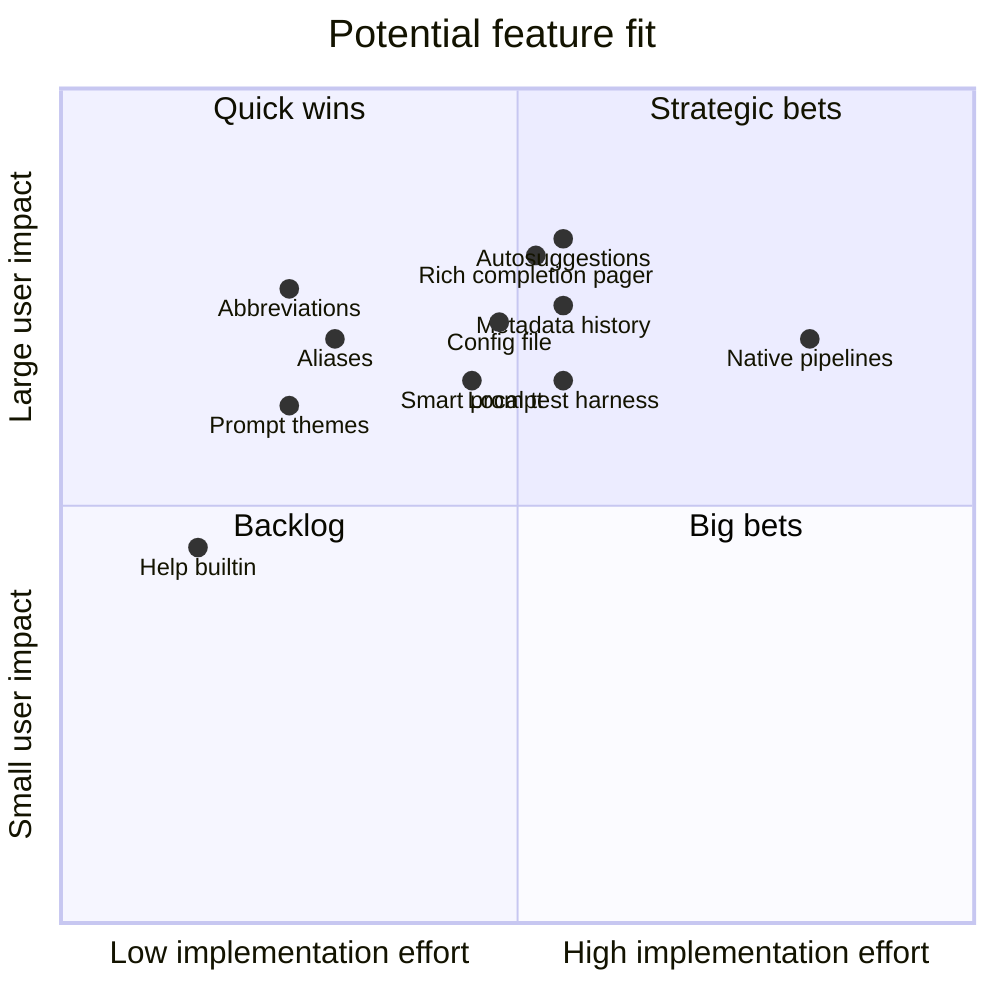

# Features And Roadmap

This file tracks what ZiggyZag already does and what would make it more useful as an everyday shell experiment.

## Completed Capabilities

| Capability | Details |
| --- | --- |
| Interactive REPL | Prompt loop, command input, cursor-aware editing, terminal mode, manual echo handling, and Ghostty-friendly title/CWD hints. |
| Builtins | `about`, `abbr`, `alias`, `back`, `cd`, `complete`, `config`, `declare`, `dirs`, `doctor`, `echo`, `env`, `exit`, `export`, `forward`, `help`, `history`, `inspect`, `jobs`, `jump`, `mkcd`, `path`, `project`, `prompt`, `pwd`, `repeat`, `run`, `source`, `timeit`, `type`, `unalias`, `unabbr`, `unset`, `up`, `vars`, `which`. |
| Command lookup | PATH search and executable detection. |
| Quoting | Single quotes, double quotes, and backslash handling. |
| Redirection | stdout/stderr redirect and append. |
| Completion | Builtin completion, executable completion, path completion, programmable completion, declarative specs, and pager descriptions. |
| History | Listing, limits, Up/Down navigation, command recall, fuzzy search, failed/slow/cwd/stats queries, metadata capture, read/write/append, startup and exit persistence. |
| Jobs | Background execution, `jobs`, job number reuse, and reaping. |
| Variables | `declare`, validation, `$VAR`, `${VAR}`, and unset expansion behavior. |
| Modern UX | Startup config, abbreviations, cursor editing, autosuggestion hooks, Ctrl-F accept, Ctrl-R fuzzy recall, syntax highlighting in smart prompt mode, and smart prompt modules. |
| Introspection | `about`, `doctor`, `inspect`, `which`, `path`, `project`, slash shortcuts, JSON output for history/jobs/prompt/env/doctor/project/dirs, and config validation/reload. |
| Convenience commands | `mkcd`, `up`, `back`, `forward`, `jump`, `repeat`, `timeit`, `source`, `env`, `vars`, and project-aware `run` make ZiggyZag more useful as a daily shell lab. |
| Pipelines | Native simple pipelines for straightforward stdout chains, with fallback for complex shell syntax. |
| Agent runtime | `ziggyzag-agentd` provides a slim Zig-native JSON-lines agent process with tool discovery, local file/search/git/build tools, terminal host actions, and Ollama/OpenAI-compatible provider calls. |
| Tests | Zig unit tests, Windows smoke script, POSIX smoke script, and GitHub Actions CI. |
| Repo polish | Logo, diagrams, public docs, contribution notes, and a project-named binary. |

## Planned Product Tracks

| Track | Shape |
| --- | --- |
| Shell core | Keep deepening ZiggyZag as a compact shell with stronger history, streaming pipelines, richer completion schemas, prompt modules, and parser diagnostics. |
| Desktop terminal | Windows-native all-Zig MVP with Win32 windowing, GDI terminal rendering, ConPTY shell hosting, keyboard input, copy/paste, wheel scrollback, resize handling, status bar, tested styled terminal grid, OSC 777 event extraction, themes, desktop config parsing, and a preserved Tauri/xterm.js spike for reference. |
| Agent panel | First-party `apps/agentd` binary is ready for the desktop host to spawn as a sidecar for approval-aware terminal assistance. |
| Shared integration | Added a small optional OSC 777 protocol for command lifecycle, cwd, status, duration, jobs, and prompt context. |

## User Experience Roadmap

## Engineering Roadmap

| Priority | Feature | Why it matters | Size |
| --- | --- | --- | --- |
| 1 | Cursor-aware line editor | Makes autosuggestions, highlighting, and Ctrl-R work with mid-line edits. | L |
| 2 | Full SQLite backend | Turns the current metadata log into indexed queryable history. | M |
| 3 | Streaming pipelines | Replaces the current buffered native pipeline MVP with true pipe handles. | L |
| 4 | Completion option schemas | Adds flags, file filters, and dynamic completions. | M |
| 5 | Cross-platform smoke tests | Keeps open-source contributions safe on Windows, Linux, and macOS. | M |
| 6 | Shell integration protocol hardening | Lets the desktop app understand command lifecycle and shell context without screen scraping. | M |
| 7 | Desktop terminal MVP hardening | Makes ZiggyZag easier to try with tabs, themes, search, settings, and a command palette. | L |
| 8 | Agent panel integration | Lets the terminal host offer approval-aware AI help without embedding a heavy app stack. | M |
| 9 | Better diagnostics | Clear parser errors make the shell easier to learn from. | S |
| 10 | Release builds | Tagged binaries make the repo easier to try. | M |

## Feature Shape

For the longer research list and source links, see [ROADMAP.md](ROADMAP.md).

## Open Questions

- Should ZiggyZag stay a learning shell or grow toward daily-driver use?
- Should shell variables and exported environment variables be split into separate stores?
- Should native pipelines stay buffered for readability or move to streaming pipes next?
- Should the config format stay shell-like or grow a JSON/TOML profile format?
- Should the PTY backend strip app-only OSC events from terminal output and emit them separately, or should the frontend continue parsing raw terminal data?
