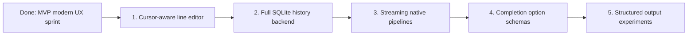

# Research-Backed Roadmap

This roadmap is based on a quick survey of modern shells and shell-adjacent tools. The goal is not to clone all of them. The goal is to choose features that make ZiggyZag useful while keeping it readable.

The first sprint implemented MVP versions of the top interactive ideas: autosuggestion hooks, richer completion output, declarative completions, metadata history, fuzzy recall, smart prompt modules, abbreviations, startup config, and native simple pipelines.

## Ranked Feature Ideas

| Rank | Feature | Inspiration | Why users care | Size | Fit |
| ---: | --- | --- | --- | --- | --- |
| 1 | Inline autosuggestions | [fish autosuggestions](https://fishshell.com/docs/current/interactive.html#autosuggestions), [PowerShell predictors](https://learn.microsoft.com/en-us/powershell/scripting/learn/shell/using-predictors?view=powershell-7.6) | Makes common commands fast and makes the shell feel current. | M | Excellent: builds on existing history and readline code. |
| 2 | Rich completion pager | [fish tab completion](https://fishshell.com/docs/current/interactive.html#tab-completion), [zsh completion system](https://zsh.sourceforge.io/Doc/Release/Completion-System.html) | Users need discoverable flags, arguments, paths, and descriptions. | M | Excellent: current completion code can evolve into candidates plus metadata. |
| 3 | Declarative completion specs | [Fig autocomplete specs](https://github.com/withfig/autocomplete), [fish complete](https://fishshell.com/docs/current/cmds/complete.html) | Lets contributors add command intelligence without editing parser internals. | M | Strong: expands the existing `complete` builtin into a public extension point. |
| 4 | SQLite command history | [Atuin CLI](https://docs.atuin.sh/cli/) | Enables search by directory, host, exit code, duration, and context. | M | Strong: current `HISTFILE` can remain as import/export fallback. |
| 5 | Fuzzy Ctrl-R history UI | [Atuin search](https://docs.atuin.sh/cli/) | Fast recall is one of the most sticky shell features. | M | Strong: first TUI-style surface without becoming a terminal emulator. |
| 6 | Syntax highlighting and error underlines | [fish syntax highlighting](https://fishshell.com/docs/current/interactive.html#syntax-highlighting), [Warp input UX](https://docs.warp.dev/terminal/universal-input) | Makes quotes, pipes, redirects, and missing commands visible before Enter. | M | Strong: parser can eventually emit token spans. |
| 7 | Abbreviations | [fish abbreviations](https://fishshell.com/docs/current/interactive.html#abbreviations) | Users see expanded commands before running them, and history stores the real command. | S | Excellent: builds naturally from current alias support. |
| 8 | Context-aware prompt modules | [Starship guide](https://starship.rs/guide/), [Starship modules](https://starship.rs/config/) | Git branch, exit status, jobs, and runtime versions provide ambient context. | M | Strong: good opportunity for fast Zig-native prompt segments. |
| 9 | Structured output mode | [Nushell pipelines](https://www.nushell.sh/book/pipelines.html), [PowerShell pipelines](https://learn.microsoft.com/en-us/powershell/module/microsoft.powershell.core/about/about_pipelines?view=powershell-7.6), [Murex typed pipelines](https://nojs.murex.rocks/docs/user-guide/pipeline.html) | Avoids brittle text parsing for JSON, process lists, git status, and tables. | L | High-upside, but should stay opt-in. |
| 10 | Inspect pipeline debug mode | [Nushell pipelines](https://www.nushell.sh/book/pipelines.html) | Helps users understand each pipeline stage while building commands. | M/L | Distinctive learning-first ZiggyZag feature. |
| 11 | Command palette or slash commands | [Warp command palette](https://docs.warp.dev/terminal/command-palette), [Warp universal input](https://docs.warp.dev/terminal/universal-input) | Makes shell actions discoverable: help, jobs, history, config, themes, completions. | M | Good fit as a shell-native `/` namespace or keybinding later. |
| 12 | Shell-native Zig scripting hooks | [xonsh tutorial](https://xon.sh/tutorial.html) | Gives ZiggyZag a unique identity beyond POSIX-like behavior. | L | Brand-defining, but later. Start with external helper hooks first. |

## Suggested Order

## Product Direction

ZiggyZag should first become a delightful learning shell:

- Keep the code readable.
- Make interactive use feel modern.
- Add features that teach shell internals.
- Keep POSIX-like behavior as the default path.
- Add experimental features behind clear commands or config flags.

That suggests the next three implementation targets should be:

1. Cursor-aware line editing so autosuggestions, syntax coloring, and Ctrl-R work beyond append-only input.
2. A real SQLite history backend behind the current metadata history log.
3. Streaming native pipelines with redirection support.
