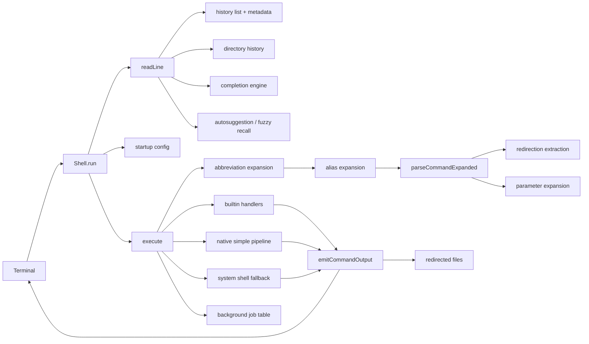
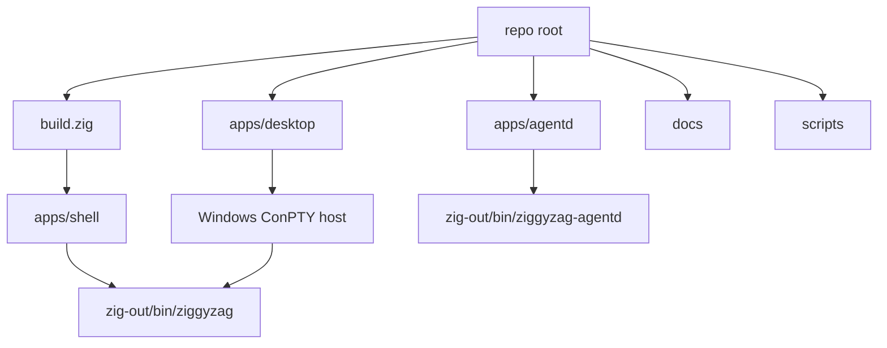
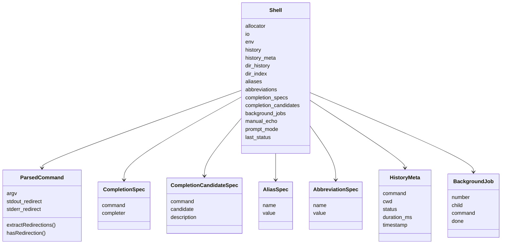

# Architecture

ZiggyZag is intentionally compact: the working shell lives in `apps/shell/src/main.zig`, with small structs for shell state, parsed commands, completion specs, aliases, abbreviations, history metadata, and background jobs. That makes the project easy to step through while still showing real shell concerns.

The repository is organized as a workspace. `apps/shell` is the shell runtime, `apps/desktop` is the native terminal host (Windows Win32 + ConPTY, macOS Cocoa + CoreText), and `apps/agentd` is the slim JSON-lines agent sidecar.

Related docs: [README.md](../README.md) is the docs hub, [scope.md](../vision/scope.md) defines product boundaries, [terminal-app.md](terminal-app.md) covers the desktop host strategy, and [data-map.md](data-map.md) explains how research, QA, and release evidence feed tasks.

## Runtime Schematic

## Workspace Shape

Root-level `zig build`, `zig build run`, and `zig build test` remain stable entry points. `zig build run-desktop` launches the native terminal MVP, and `zig build run-agentd -- --describe-tools` exercises the agent sidecar.

## Command Lifecycle

1. The REPL prints a prompt and reads bytes from stdin.
2. Startup config can register aliases, abbreviations, completions, exports, and prompt mode.
3. Terminal editing handles cursor movement, Home/End, Delete, Ctrl-A/E/U/K/W, tabs, backspace, Up/Down history navigation, Ctrl-F autosuggestion accept, and Ctrl-R fuzzy recall.
4. Non-empty commands are stored in history, and execution metadata is recorded.
5. Abbreviations and aliases expand the first command word once.
6. The parser tokenizes quotes, escapes, redirection operators, and `$VAR` or `${VAR}` expansion.
7. Builtins execute directly in-process.
8. Simple pipelines run through the native Zig pipeline path; complex shell syntax falls back to the platform shell.
9. Background jobs are tracked and reaped before later prompts.
10. Directory history, project detection, and metadata history make later navigation and inspection useful.
11. stdout/stderr are emitted or redirected.

## Core State

## Why Some Work Is Delegated

Simple pipelines now have a native Zig path. Complex syntax still uses `/bin/sh -c` on POSIX and `cmd /C` on Windows. That keeps the project small while leaving room for a deeper streaming pipeline engine later.

## Desktop Host Boundary

The desktop terminal app should own windowing, tabs, settings, terminal rendering, PTY lifecycle, and app-level commands. The Zig shell should continue to own parsing, execution, history, completions, prompt behavior, and shell state.

The macOS host (`macos_app.zig`) runs a Cocoa NSWindow + NSView with CoreText grid rendering and CoreGraphics draws, sharing the same POSIX PTY backend and AgentD protocol as the Windows host. Both platforms expose the same overlay system: command palette, scrollback search, quick select, settings, theme cycling, and AgentD universal input.

Optional shell integration should be explicit and ignorable by other terminals. The first shape should be OSC-style events for session readiness, prompt context, command start, command finish, and job changes. Larger payloads can move to sidecar IPC later if the event stream becomes too cramped.

## Design Rules

- Keep the default prompt and core output stable so scripts and tests stay reliable.
- Prefer small helper functions over hidden framework magic.
- Keep feature behavior readable before making it clever.
- Make every added UX feature teach a shell concept.
