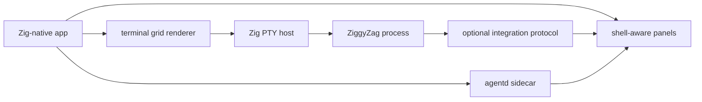

# Built-In Terminal App Strategy

ZiggyZag can grow a small desktop terminal app without losing its identity as a Zig project. The app should be a focused Zig-native host for the ZiggyZag executable: fast startup, reliable PTY behavior, modern editing surfaces, and clear hooks for shell-aware UI.

The earlier Tauri/xterm.js direction was explored and dropped. Use Terax as a product-shape reference, WezTerm as a quality reference, and Ghostty/libghostty as the closest Zig-native terminal reference. Do not embed WezTerm wholesale; the goal is a ZiggyZag-owned product surface, not a wrapper around another terminal.

Related docs: [all-zig-terminal.md](all-zig-terminal.md) covers the all-Zig architecture lane, [research.md](../vision/research.md) maps Ghostty/WezTerm signals to tasks, [alpha-tasks.md](../vision/alpha-tasks.md) tracks remaining alpha work, and [task-system.md](task-system.md) explains how work moves between docs.

## Product Thesis

The terminal app should make ZiggyZag easier to try, demo, and use daily while preserving the existing CLI as the source of truth. The desktop layer is valuable when it can expose shell-native context that generic terminals cannot easily know: command metadata, completions, history search, directory context, project tasks, background jobs, and structured command events.

The product should stay learning-friendly:

- Keep the CLI fully usable outside the app.
- Treat app features as progressive enhancements over a normal PTY session.
- Prefer explicit protocols over screen scraping.
- Keep terminal fundamentals boring and dependable.

## Reference Architecture



## Core Components

| Layer | Suggested choice | Responsibility |
| --- | --- | --- |
| Desktop shell | Zig-native windowing layer | Native windowing, menus, file dialogs, app packaging, and input routing. |
| Backend bridge | Zig PTY abstraction | PTY lifecycle, process spawning, environment setup, stream fanout, app protocol parsing. |
| Terminal UI | Zig renderer | Terminal viewport, tabs, keybinding routing, status surfaces, command palette. |
| Agent sidecar | `ziggyzag-agentd` | JSON-lines tool protocol, approval-aware host actions, local search/file/git/build tools, and Ollama/OpenAI-compatible provider calls. |
| Shell runtime | Existing ZiggyZag binary | Parsing, execution, history, completions, prompt, shell state. |
| Integration channel | stdout escape sequences or sidecar IPC | Structured shell events that enrich the UI without breaking normal terminal use. |

## Binary Contract

Root-level `zig build` must keep producing `zig-out/bin/ziggyzag` for local development, CI, and early desktop experiments. The desktop app can use that path during development, but packaged builds should copy or build a deliberate `ziggyzag` binary into the app bundle and launch that known artifact.

Do not let the desktop app depend on an accidental working-tree `zig-out` location in production packaging.

## Current Alpha Scope

The repo now contains a Windows-native all-Zig alpha under `apps/desktop`:

- Win32 windowing and GDI terminal-grid rendering.
- Windows ConPTY shell hosting.
- PTY-backed vertical and horizontal split panes, active-pane focus, active-pane close, and config-restored pane layout.
- Keyboard input forwarded to the shell process.
- Resize handling across the window, grid, and pseudoconsole.
- Status bar and window-title updates from shell integration events, including project and git prompt context.
- Built-in terminal themes, theme-aware ANSI colors, a settings overlay, live theme cycling, and desktop config loading.
- Tested terminal grid and OSC 777 event extraction.
- Slim `ziggyzag-agentd` sidecar under `apps/agentd`, plus a Windows desktop AgentD panel for health/tools/approval previews.

Not yet complete in the native desktop host: tabs, full process/session restore, graphical settings writes, mouse selection, full combining-mark/emoji/grapheme handling, and native macOS/Linux windows.

For macOS/Linux alpha artifacts, `ziggyzag-desktop` currently builds and runs as a terminal-attached launcher. It resolves the ZiggyZag shell binary, reports the selected POSIX backend, and starts the shell in the calling terminal. It now prefers ZiggyZag's native POSIX PTY relay, then falls back to `script(1)`, then direct stdio. It does not open a native graphical window yet. The usable POSIX alpha surface is the shell binary, AgentD, smoke script, and this launcher.

A Tauri 2 + React + xterm.js prototype was previously explored (PTY create/write/resize/close commands, a `terminal://data` output stream, and OSC 777 integration parsing). It has been removed; the all-Zig host is the only desktop route.

The primary path is documented in [all-zig-terminal.md](all-zig-terminal.md).

## Tester-Facing MVP Scope

The first hardened version should prove that the app can host ZiggyZag well:

1. Launch ZiggyZag in a real PTY with correct resize, cleanup, paste, Ctrl+C interrupt, Ctrl+Shift+C copy-visible, and wheel scrollback behavior.
2. Provide one window with split panes, each backed by a separate ZiggyZag process; tabs remain the next navigation surface.
3. Deepen persisted app settings: shell path, startup directory, scrollback size, keybindings, and a proper settings editor.
4. Add a command palette for app-level commands such as split, close pane, focus pane, theme, search, quick select, AgentD actions, and open settings.
5. Keep hardening the AgentD panel backed by `ziggyzag-agentd --stdio`, with explicit approval before terminal writes or build commands.
6. Surface session status: current directory, last command status, running command indicator, and background job count when ZiggyZag exposes them.
7. Keep packaging Windows native desktop builds while macOS/Linux ship shell, AgentD, and the terminal-attached desktop launcher until POSIX native graphical hosting is ready.

MVP success is not visual novelty. It is confidence that ZiggyZag behaves like a real interactive shell inside a desktop host.

## Tomorrow Test Pass

Use the first friend-test pass to answer concrete questions:

| Area | What to try | Pass signal |
| --- | --- | --- |
| Windows launch | `zig build run-desktop` | Window opens and prompt appears. |
| macOS/Linux desktop launcher | `zig build run-desktop` | Prints `ZiggyZag Desktop (POSIX PTY)`, launches the shell in the current terminal through the native POSIX PTY relay when available, and exits cleanly after `exit`. |
| Input | Type commands, edit with Backspace, press Enter | Text reaches the shell and output returns. |
| Clipboard | Ctrl+V, Shift+Insert, Ctrl+Shift+C | Paste writes into the PTY; copy places visible text on the clipboard. Ctrl+C remains shell interrupt. |
| Resize | Drag the window smaller/larger | Grid resizes without losing the running session. |
| Scrollback | Produce long output and wheel upward | Previous visible rows can be reviewed. |
| Splits | Press Ctrl+Shift+D, Ctrl+Shift+E, Ctrl+Shift+N, Ctrl+Shift+W | Panes open with independent shells, focus moves, and close only kills the active pane. |
| Shell events | Run successful and failing commands | Status/title reflects command context. |
| AgentD | Press Ctrl+Shift+A, then use palette AgentD health/tools/preview/approve | Panel shows sidecar JSON, preview does not write until approved. |
| Provider failure | Run `--oneshot` without Ollama | Structured `provider_error`, no crash. |

Clipboard, resize, scrollback, and shell-event checks apply to the Windows native desktop host in this alpha. On macOS/Linux, run the shell directly with `./zig-out/bin/ziggyzag`, AgentD directly with `./zig-out/bin/ziggyzag-agentd`, and the launcher with `zig build run-desktop`.

## Integration Protocol Ideas

Start with a minimal protocol that is optional, versioned, and safe to ignore. The shell should continue to work in any terminal if the app is absent.

### Escape Sequence Events

ZiggyZag can emit OSC-style messages for app-aware clients:

```text
OSC 777 ; ziggyzag:event:{json} BEL
```

Potential event types:

- `session.ready`: shell version, protocol version, capabilities.
- `prompt.rendered`: current directory, prompt mode, git/project summary when available.
- `command.started`: command id, cwd, argv preview, timestamp.
- `command.finished`: command id, exit status, duration, cwd.
- `history.updated`: command id and metadata pointer, not full sensitive command text by default.
- `jobs.changed`: background job count and short statuses.
- `completion.candidates`: optional rich completions for app-side display experiments.

The current `prompt.rendered` payload already carries cwd, prompt mode, last status, last duration, jobs, project kind, and git branch/status counts. This keeps the PTY path simple and lets non-ZiggyZag terminals ignore unknown OSC sequences.

### Sidecar IPC Later

If escape sequences become too cramped, add a local sidecar channel negotiated through environment variables:

- `ZIGGYZAG_APP=1`
- `ZIGGYZAG_PROTOCOL_VERSION=1`
- `ZIGGYZAG_IPC_PATH=<local socket or named pipe>`

Use sidecar IPC for larger payloads such as history search responses, structured command output previews, settings sync, or long-running background task updates. Keep command execution itself in the PTY so terminal semantics remain understandable.

## WezTerm-Inspired Quality Bar

WezTerm is useful as a north star for fit and finish:

- Tabs and panes should feel predictable and keyboard-first.
- Font rendering, ligatures, Unicode width, mouse selection, and clipboard behavior must be tested seriously.
- Config should be explicit, portable, and inspectable.
- Performance should stay smooth with large scrollback and noisy command output.
- Advanced features should not compromise terminal compatibility.

The app should borrow lessons, not implementation. Embedding WezTerm would obscure the product boundary and make ZiggyZag's shell-aware UI harder to own.

## Non-Goals

- Replacing the standalone ZiggyZag CLI.
- Implementing a complete terminal emulator from scratch.
- Embedding WezTerm or depending on WezTerm internals.
- Building SSH, multiplexing, remote workspaces, or synchronized cloud settings in the MVP.
- Making the desktop app responsible for shell parsing or command execution.
- Requiring app-only behavior for core ZiggyZag features.
- Capturing or storing command text outside existing history rules without explicit user control.

## Suggested Sequence

1. Done: removed the Tauri spike now that the all-Zig skeleton exists.
2. Harden the Zig PTY host and terminal grid renderer with selection, richer ANSI coverage, and process cleanup tests.
3. Persist basic settings and add tab management.
4. Extend app-aware OSC events only where the UI has a real need.
5. Use those events for status UI and command palette actions.
6. Revisit sidecar IPC only after the event stream has real pressure.

The guiding rule: keep the PTY path conventional, then layer ZiggyZag-specific intelligence beside it.

For the next-wave task list and acceptance signals, see [alpha-tasks.md](../vision/alpha-tasks.md).
